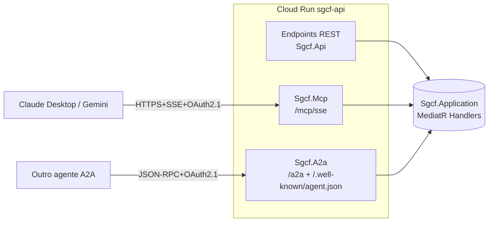
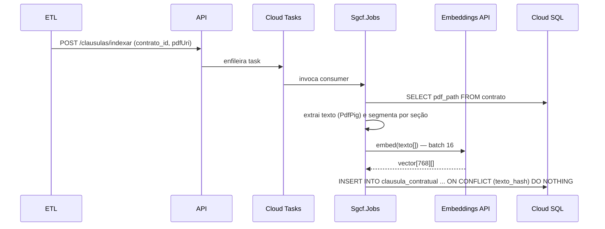

# Documento de Arquitetura Técnica — SGCF v1.0

**Projeto:** Sistema de Gestão de Contratos de Financiamento (SGCF)
**Empresa:** Proxys Comércio Eletrônico
**Sponsor / PO:** Welysson Soares
**Squad:** 1 dev sênior + 2 controllers (PO/analistas)
**Período:** M0 = 11/Mai/2026 — M8 = 20/Nov/2026 (28 semanas corridas / ~24 úteis)
**Stack:** .NET 11 + ASP.NET Core + EF Core 11 + PostgreSQL 16 (Cloud SQL) + NodaTime + Cloud Run (GCP southamerica-east1)
**Documentos-fonte:** SPEC v1.0, Business Case v1.0, ADR-001..015, Anexo A (NDF), Anexo B (Modalidades), Anexo C (Antecipação)

---

## §1. Visão geral da arquitetura

### 1.1 Princípios arquiteturais

1. **Clean Architecture + DDD tático.** Domain puro, sem dependência de framework. Application orquestra via MediatR (CQRS). Infrastructure isola EF Core, HTTP clients e adapters GCP. API/MCP/A2A são apresentadores.
2. **API-first.** Toda funcionalidade exposta via REST com contrato OpenAPI 3.1. MCP e A2A são adaptadores finos sobre os mesmos handlers MediatR — não há lógica de negócio duplicada.
3. **Funções puras no motor financeiro.** Toda regra de cálculo (juros pro-rata, MTM, antecipação, gross-up) é função pura: sem `DateTime.Now`, sem I/O, sem random, sem mutação compartilhada. `IClock` injetável.
4. **Single source of truth.** PostgreSQL 16 é o sistema de registro. Redis é cache de leitura efêmero. Excel histórico fica congelado em Cloud Storage após cutover.
5. **Imutabilidade auditável.** Toda escrita gera linha em `audit_log` via EF Core `SaveChangesInterceptor`. Origem (`rest`/`mcp`/`a2a`) sempre registrada.
6. **Simple > Clever** (ADR-014). Preferir solução óbvia. Sem AutoMapper, sem Event Sourcing no MVP, sem microservices.
7. **Determinismo financeiro.** Aritmética de `Money` sempre via `HalfUp(6)` (`MidpointRounding.AwayFromZero`). Nunca `double`. Nunca `decimal` cru para dinheiro.
8. **LLM nunca no caminho crítico** (ADR-011, ADR-015). RAG só busca cláusulas textuais. Números calculados saem exclusivamente do motor estruturado.

### 1.2 Diagrama de componentes (alto nível)

```mermaid
graph TB
    subgraph "Clientes"
        UI[Front-end futuro<br/>headless por 3 meses]
        AGENT[Agentes Claude/Gemini<br/>via MCP]
        PEER[Outros agentes<br/>via A2A]
        ETL[Console Migração<br/>tools/Migracao]
    end

    subgraph "GCP southamerica-east1"
        ARMOR[Cloud Armor WAF<br/>+ HTTPS LB TLS 1.3]

        subgraph "Cloud Run — Sgcf.Api"
            REST[REST /api/v1/*]
            MCP[MCP /mcp/sse<br/>Sgcf.Mcp]
            A2A[A2A /a2a/*<br/>Sgcf.A2a]
            WK[/.well-known/agent.json]
        end

        subgraph "Cloud Run — Sgcf.Jobs"
            JOB[Consumers Cloud Tasks]
        end

        APP[(Application Layer<br/>MediatR Handlers)]
        DOM[(Domain<br/>VOs + Aggregates + Strategies)]
        INFRA[(Infrastructure<br/>EF Core + Adapters)]

        SQL[(Cloud SQL PG16<br/>+ pgvector)]
        REDIS[(Memorystore Redis 7)]
        TASKS[Cloud Tasks]
        SCHED[Cloud Scheduler]
        GCS[Cloud Storage<br/>PDFs + backups]
        SM[Secret Manager]
        LOG[Cloud Logging<br/>+ Trace + Monitoring]
    end

    subgraph "Externos"
        BCB[BCB API<br/>PTAX]
        IDP[Identity Provider<br/>OAuth 2.1 + OIDC]
        EMBED[Embeddings API<br/>768-dim]
    end

    UI -->|HTTPS| ARMOR
    AGENT -->|HTTPS+SSE| ARMOR
    PEER -->|HTTPS JSON-RPC| ARMOR
    ARMOR --> REST & MCP & A2A & WK
    REST & MCP & A2A --> APP
    APP --> DOM
    APP --> INFRA
    INFRA --> SQL & REDIS & TASKS & GCS & SM
    INFRA --> BCB & EMBED
    SCHED --> TASKS --> JOB
    JOB --> APP
    REST & MCP & A2A & JOB --> LOG
    ETL -->|HTTPS REST| ARMOR
    REST & MCP & A2A --> IDP
```

### 1.3 Camadas (Clean Architecture)

| Camada | Projeto | Conhece | Não pode conhecer |
|---|---|---|---|
| Presentation | `Sgcf.Api`, `Sgcf.Mcp`, `Sgcf.A2a` | Application | Domain (direto), Infrastructure |
| Application | `Sgcf.Application` | Domain, abstrações de Infra (`IRepository`, `IClock`, `IPtaxProvider`) | EF Core, HTTP clients, GCP SDKs |
| Domain | `Sgcf.Domain` | (nada externo) | Tudo |
| Infrastructure | `Sgcf.Infrastructure` | Domain, Application | Apresentadores |
| Jobs | `Sgcf.Jobs` | Application | — |

### 1.4 Mapa de dependências (regra do compilador)

```
Sgcf.Domain  ←  Sgcf.Application  ←  Sgcf.Api / Sgcf.Mcp / Sgcf.A2a / Sgcf.Jobs
                       ↑
                Sgcf.Infrastructure  (implementa interfaces de Application)
```

Validar via teste de arquitetura (`NetArchTest.Rules` em `Sgcf.Domain.Tests`):

```csharp
[Fact] public void Domain_nao_depende_de_EFCore() =>
    Types.InAssembly(typeof(Contrato).Assembly)
         .ShouldNot().HaveDependencyOn("Microsoft.EntityFrameworkCore")
         .GetResult().IsSuccessful.Should().BeTrue();
```

---

## §2. Modelo de dados físico (PostgreSQL 16)

### 2.1 Convenções

- Schema único `sgcf` (não fragmentar por modalidade — facilita JOINs).
- PK = `uuid` v7 (gerado em C# via `Guid.CreateVersion7()`) para boa localidade de B-Tree.
- Money: `numeric(20,6)` + coluna `_moeda char(3)` separada. Nunca `numeric` desacompanhado de moeda.
- Datas de domínio (vencimento, contratação): `date` (mapeado para `LocalDate` via NodaTime).
- Timestamps de auditoria: `timestamptz` (mapeado para `Instant`).
- Soft delete: coluna `deleted_at timestamptz NULL` + filtro global EF Core.

### 2.2 Entidades núcleo

```sql
-- Catálogo de bancos com 11 campos novos do Anexo C
CREATE TABLE sgcf.banco_config (
    id              uuid PRIMARY KEY,
    codigo_compe    char(3) NOT NULL UNIQUE,
    razao_social    text NOT NULL,
    apelido         text NOT NULL,
    -- 11 campos do Anexo C
    aceita_liquidacao_total       boolean NOT NULL DEFAULT true,
    aceita_liquidacao_parcial     boolean NOT NULL DEFAULT true,
    exige_anuencia_expressa       boolean NOT NULL DEFAULT false,
    exige_parcela_inteira         boolean NOT NULL DEFAULT false,
    aviso_previo_min_dias_uteis   smallint NOT NULL DEFAULT 0,
    valor_minimo_parcial_pct      numeric(7,4),
    padrao_antecipacao            smallint NOT NULL CHECK (padrao_antecipacao BETWEEN 1 AND 5),
    break_funding_fee_pct         numeric(7,4),
    tla_pct_sobre_saldo           numeric(7,4),
    tla_pct_por_mes_remanescente  numeric(7,4),
    observacoes_antecipacao       text,
    created_at      timestamptz NOT NULL DEFAULT now(),
    updated_at      timestamptz NOT NULL DEFAULT now()
);

-- Contrato (raiz agregada)
CREATE TABLE sgcf.contrato (
    id                uuid PRIMARY KEY,
    numero_externo    text NOT NULL,
    banco_id          uuid NOT NULL REFERENCES sgcf.banco_config(id),
    modalidade        text NOT NULL CHECK (modalidade IN
        ('FINIMP','REFINIMP','LEI_4131','NCE','BALCAO_CAIXA','FGI')),
    moeda             char(3) NOT NULL,
    valor_principal   numeric(20,6) NOT NULL,
    data_contratacao  date NOT NULL,
    data_vencimento   date NOT NULL,
    taxa_aa           numeric(10,6) NOT NULL,
    base_calculo      smallint NOT NULL CHECK (base_calculo IN (252,360,365)),
    status            text NOT NULL CHECK (status IN
        ('ATIVO','LIQUIDADO','VENCIDO','INADIMPLENTE','CANCELADO')),
    contrato_pai_id   uuid REFERENCES sgcf.contrato(id), -- REFINIMP usa
    observacoes       text,
    created_at        timestamptz NOT NULL DEFAULT now(),
    updated_at        timestamptz NOT NULL DEFAULT now(),
    deleted_at        timestamptz,
    row_version       bytea NOT NULL DEFAULT '\x00'   -- xmin via concurrency token
);
CREATE INDEX ix_contrato_banco       ON sgcf.contrato(banco_id) WHERE deleted_at IS NULL;
CREATE INDEX ix_contrato_modalidade  ON sgcf.contrato(modalidade) WHERE deleted_at IS NULL;
CREATE INDEX ix_contrato_status      ON sgcf.contrato(status) WHERE deleted_at IS NULL;
CREATE INDEX ix_contrato_vencimento  ON sgcf.contrato(data_vencimento) WHERE deleted_at IS NULL;
CREATE INDEX ix_contrato_pai         ON sgcf.contrato(contrato_pai_id) WHERE contrato_pai_id IS NOT NULL;

-- Parcelas
CREATE TABLE sgcf.parcela (
    id              uuid PRIMARY KEY,
    contrato_id     uuid NOT NULL REFERENCES sgcf.contrato(id) ON DELETE CASCADE,
    numero          smallint NOT NULL,
    data_vencimento date NOT NULL,
    valor_principal numeric(20,6) NOT NULL,
    valor_juros     numeric(20,6) NOT NULL,
    moeda           char(3) NOT NULL,
    status          text NOT NULL CHECK (status IN ('PENDENTE','PAGA','VENCIDA','PARCIAL')),
    data_pagamento  date,
    valor_pago      numeric(20,6),
    UNIQUE (contrato_id, numero)
);
CREATE INDEX ix_parcela_vencimento ON sgcf.parcela(data_vencimento) WHERE status='PENDENTE';
```

### 2.3 Tabelas de extensão por modalidade (Anexo B)

```sql
CREATE TABLE sgcf.finimp_detail (
    contrato_id        uuid PRIMARY KEY REFERENCES sgcf.contrato(id) ON DELETE CASCADE,
    invoice_numero     text NOT NULL,
    fornecedor_pais    char(2) NOT NULL,
    rof_numero         text,
    cdb_cativo_valor   numeric(20,6),
    cdb_cativo_taxa    numeric(10,6),
    iof_aliq_pct       numeric(7,4) NOT NULL,
    irrf_aliq_pct      numeric(7,4) NOT NULL,
    momento_cambio     text NOT NULL CHECK (momento_cambio IN ('PTAX_D1','PTAX_D0','SPOT_INTRADAY'))
);

CREATE TABLE sgcf.refinimp_detail (
    contrato_id          uuid PRIMARY KEY REFERENCES sgcf.contrato(id) ON DELETE CASCADE,
    finimp_origem_id     uuid NOT NULL REFERENCES sgcf.contrato(id),
    motivo_refinanciamento text NOT NULL
);

CREATE TABLE sgcf.lei_4131_detail (
    contrato_id      uuid PRIMARY KEY REFERENCES sgcf.contrato(id) ON DELETE CASCADE,
    sblc_emissor     text,
    sblc_valor       numeric(20,6),
    sblc_moeda       char(3),
    market_flex_pct  numeric(7,4),
    iof_aliq_pct     numeric(7,4) NOT NULL,
    irrf_aliq_pct    numeric(7,4) NOT NULL
);

CREATE TABLE sgcf.nce_detail (
    contrato_id      uuid PRIMARY KEY REFERENCES sgcf.contrato(id) ON DELETE CASCADE,
    finalidade       text NOT NULL,
    indexador        text NOT NULL CHECK (indexador IN ('CDI','PREFIXADO','TR','IPCA'))
);

CREATE TABLE sgcf.balcao_caixa_detail (
    contrato_id              uuid PRIMARY KEY REFERENCES sgcf.contrato(id) ON DELETE CASCADE,
    duplicatas_cessao_valor  numeric(20,6) NOT NULL,
    duplicatas_qtde          int NOT NULL,
    tla_isento_motivo        text
);

CREATE TABLE sgcf.fgi_detail (
    contrato_id          uuid PRIMARY KEY REFERENCES sgcf.contrato(id) ON DELETE CASCADE,
    fgi_garantia_pct     numeric(7,4) NOT NULL,
    fgi_taxa_concessao   numeric(7,4) NOT NULL,
    bndes_protocolo      text
);
```

### 2.4 Garantias (8 tipos com polimorfismo via tabelas filhas)

```sql
CREATE TABLE sgcf.garantia (
    id            uuid PRIMARY KEY,
    contrato_id   uuid NOT NULL REFERENCES sgcf.contrato(id) ON DELETE CASCADE,
    tipo          text NOT NULL CHECK (tipo IN
        ('CDB_CATIVO','SBLC','AVAL','ALIENACAO_FIDUCIARIA',
         'DUPLICATAS','RECEBIVEIS_CARTAO','BOLETO_BANCARIO','FGI')),
    valor         numeric(20,6) NOT NULL,
    moeda         char(3) NOT NULL,
    data_vigencia_ini date NOT NULL,
    data_vigencia_fim date,
    status        text NOT NULL CHECK (status IN ('ATIVA','LIBERADA','EXECUTADA')),
    UNIQUE (contrato_id, tipo, data_vigencia_ini)
);
-- 8 tabelas de extensão (apenas 2 mostradas; padrão idêntico)
CREATE TABLE sgcf.garantia_cdb_cativo (
    garantia_id uuid PRIMARY KEY REFERENCES sgcf.garantia(id) ON DELETE CASCADE,
    cdb_taxa_aa numeric(10,6) NOT NULL,
    cdb_vencimento date NOT NULL,
    banco_emissor_id uuid REFERENCES sgcf.banco_config(id)
);
CREATE TABLE sgcf.garantia_sblc (
    garantia_id uuid PRIMARY KEY REFERENCES sgcf.garantia(id) ON DELETE CASCADE,
    swift_code text NOT NULL,
    beneficiario text NOT NULL,
    emissor_pais char(2) NOT NULL
);
-- Análogas: garantia_aval, garantia_alienacao_fiduciaria, garantia_duplicatas,
--           garantia_recebiveis_cartao, garantia_boleto_bancario, garantia_fgi
```

### 2.5 Hedge (NDF Forward + Collar — Anexo A)

```sql
CREATE TABLE sgcf.instrumento_hedge (
    id              uuid PRIMARY KEY,
    contrato_id     uuid NOT NULL REFERENCES sgcf.contrato(id), -- 1:1 dedicado
    tipo            text NOT NULL CHECK (tipo IN ('NDF_FORWARD','NDF_COLLAR')),
    contraparte_id  uuid NOT NULL REFERENCES sgcf.banco_config(id),
    notional        numeric(20,6) NOT NULL,
    moeda_base      char(3) NOT NULL,
    moeda_quote     char(3) NOT NULL DEFAULT 'BRL',
    data_contratacao date NOT NULL,
    data_vencimento date NOT NULL,
    strike_forward  numeric(20,6),    -- NDF_FORWARD usa
    strike_put      numeric(20,6),    -- NDF_COLLAR usa
    strike_call     numeric(20,6),    -- NDF_COLLAR usa
    status          text NOT NULL CHECK (status IN ('ATIVO','LIQUIDADO','CANCELADO')),
    CONSTRAINT ck_strikes_forward CHECK (
        tipo <> 'NDF_FORWARD' OR strike_forward IS NOT NULL),
    CONSTRAINT ck_strikes_collar CHECK (
        tipo <> 'NDF_COLLAR' OR (strike_put IS NOT NULL AND strike_call IS NOT NULL
                                  AND strike_put < strike_call)),
    UNIQUE (contrato_id) -- garante 1:1
);

CREATE TABLE sgcf.mtm_snapshot (
    id              uuid PRIMARY KEY,
    instrumento_id  uuid NOT NULL REFERENCES sgcf.instrumento_hedge(id),
    momento         timestamptz NOT NULL,
    spot            numeric(20,6) NOT NULL,
    mtm_brl         numeric(20,6) NOT NULL,
    fonte           text NOT NULL CHECK (fonte IN ('INTRADAY_5MIN','EOD','FIXING')),
    UNIQUE (instrumento_id, momento, fonte)
);
CREATE INDEX ix_mtm_inst_tempo ON sgcf.mtm_snapshot(instrumento_id, momento DESC);
```

### 2.6 FX e parâmetros

```sql
CREATE TABLE sgcf.cotacao_fx (
    id          uuid PRIMARY KEY,
    moeda_base  char(3) NOT NULL,
    moeda_quote char(3) NOT NULL DEFAULT 'BRL',
    momento     timestamptz NOT NULL,
    tipo        text NOT NULL CHECK (tipo IN ('PTAX_D0','PTAX_D1','SPOT_INTRADAY','FIXING')),
    valor_compra numeric(20,6) NOT NULL,
    valor_venda  numeric(20,6) NOT NULL,
    fonte        text NOT NULL,
    UNIQUE (moeda_base, moeda_quote, momento, tipo)
);
CREATE INDEX ix_cotacao_fx_lookup ON sgcf.cotacao_fx(moeda_base, tipo, momento DESC);

CREATE TABLE sgcf.parametro_cotacao (
    chave    text PRIMARY KEY,
    valor    text NOT NULL,
    updated_at timestamptz NOT NULL DEFAULT now(),
    updated_by uuid NOT NULL
);
-- Ex: ('iof_cambio_aliq_pct', '0.38'), ('irrf_juros_exterior_aliq_pct', '15')
```

### 2.7 Simulação de antecipação (Anexo C)

```sql
CREATE TABLE sgcf.simulacao_antecipacao (
    id              uuid PRIMARY KEY,
    contrato_id     uuid NOT NULL REFERENCES sgcf.contrato(id),
    data_simulacao  date NOT NULL,
    data_efetivacao date NOT NULL,
    tipo            text NOT NULL CHECK (tipo IN ('TOTAL','PARCIAL')),
    valor_antecipar numeric(20,6) NOT NULL,
    padrao_aplicado char(1) NOT NULL CHECK (padrao_aplicado IN ('A','B','C','D','E')),
    -- 15 componentes serializados (C1..C15) + metadados de cálculo + alertas
    componentes_custo jsonb NOT NULL,
    total_pagar     numeric(20,6) NOT NULL,
    economia_brl    numeric(20,6),
    cenario_cdi_brl numeric(20,6),  -- comparativo "não antecipar e aplicar em CDI"
    alertas         jsonb NOT NULL DEFAULT '[]'::jsonb,
    requer_anuencia boolean NOT NULL DEFAULT false,
    created_at      timestamptz NOT NULL DEFAULT now(),
    created_by      uuid NOT NULL,
    source          text NOT NULL CHECK (source IN ('rest','mcp','a2a'))
);
CREATE INDEX ix_sim_contrato ON sgcf.simulacao_antecipacao(contrato_id, created_at DESC);
```

Estrutura do JSONB `componentes_custo`:

```json
{
  "C1_principal": 1000000.0,
  "C2_juros_pro_rata": 12345.67,
  "C3_juros_periodo_integral": 0.0,
  "C4_juros_futuros_capitalizados": 0.0,
  "C5_desconto_taxa_mercado": 0.0,
  "C6_break_flat": 10000.0,
  "C7_indenizacao_banco": 2500.0,
  "C8_tla_bacen": 0.0,
  "C9_iof_complementar": 0.0,
  "C10_spread_cambial": 0.0,
  "C11_variacao_cambial": 0.0,
  "C12_irrf_complementar": 0.0,
  "C13_ndf_descasamento": 0.0,
  "C14_tarifa_operacao": 0.0,
  "C15_cdb_cativo_restituicao": -500000.0,
  "_base_calculo": 360,
  "_dias_decorridos": 45,
  "_dias_remanescentes": 315,
  "_moeda": "USD"
}
```

### 2.8 RAG — cláusulas contratuais (ADR-015)

```sql
CREATE EXTENSION IF NOT EXISTS vector;

CREATE TABLE sgcf.clausula_contratual (
    id           uuid PRIMARY KEY,
    contrato_id  uuid NOT NULL REFERENCES sgcf.contrato(id) ON DELETE CASCADE,
    secao        text NOT NULL,                    -- "Antecipação", "Inadimplemento"...
    pagina       smallint,
    texto        text NOT NULL,
    texto_hash   bytea NOT NULL,                   -- sha256 p/ deduplicar
    embedding    vector(768) NOT NULL,             -- modelo: text-embedding-3-small
    modelo_emb   text NOT NULL,
    created_at   timestamptz NOT NULL DEFAULT now()
);
CREATE INDEX ix_clausula_contrato ON sgcf.clausula_contratual(contrato_id);
CREATE INDEX ix_clausula_emb_hnsw ON sgcf.clausula_contratual
    USING hnsw (embedding vector_cosine_ops) WITH (m = 16, ef_construction = 64);
```

### 2.9 Auditoria

```sql
CREATE TABLE sgcf.audit_log (
    id          bigserial PRIMARY KEY,
    occurred_at timestamptz NOT NULL DEFAULT now(),
    actor_sub   text NOT NULL,                     -- sub do JWT
    actor_role  text NOT NULL,
    source      text NOT NULL CHECK (source IN ('rest','mcp','a2a','job','migration')),
    entity      text NOT NULL,                     -- "contrato","parcela",...
    entity_id   uuid,
    operation   text NOT NULL CHECK (operation IN ('CREATE','UPDATE','DELETE','READ_SENSITIVE')),
    diff_json   jsonb,                              -- antes/depois (mascarado)
    request_id  uuid NOT NULL,
    ip_hash     bytea
);
CREATE INDEX ix_audit_entity ON sgcf.audit_log(entity, entity_id, occurred_at DESC);
CREATE INDEX ix_audit_actor  ON sgcf.audit_log(actor_sub, occurred_at DESC);
```

Particionamento mensal (retenção 5 anos — ADR-006):
```sql
ALTER TABLE sgcf.audit_log PARTITION BY RANGE (occurred_at);
-- Cloud Scheduler + pg_partman criam partições mensais automaticamente
```

### 2.10 Interceptor EF Core para auditoria

```csharp
public sealed class AuditInterceptor(ICurrentUser user, IClock clock, IRequestContext req)
    : SaveChangesInterceptor
{
    public override ValueTask<InterceptionResult<int>> SavingChangesAsync(
        DbContextEventData e, InterceptionResult<int> r, CancellationToken ct = default)
    {
        var ctx = e.Context!;
        var logs = ctx.ChangeTracker.Entries()
            .Where(x => x.State is EntityState.Added or EntityState.Modified or EntityState.Deleted)
            .Where(x => x.Entity is IAuditable)
            .Select(x => AuditMapper.Map(x, user, clock.GetCurrentInstant(), req));
        ctx.Set<AuditLog>().AddRange(logs);
        return base.SavingChangesAsync(e, r, ct);
    }
}
```

### 2.11 Estratégia de migrations

- **Code First** (EF Core 11) com `dotnet ef migrations add` por slice incremental.
- Migrations idempotentes; cada deploy roda `dotnet ef database update --connection <secret>` antes do tráfego (init container no Cloud Run job).
- Migrations destrutivas (DROP COLUMN, RENAME) exigem ADR + janela de 2 deploys (expand-contract).
- Seeds em `Sgcf.Infrastructure/Seeds/*.cs` aplicados apenas em dev/staging via flag `Sgcf__Seed__Enabled=true`.

### 2.12 Índices e constraints adicionais

| Tabela | Índice/Constraint | Justificativa |
|---|---|---|
| `contrato` | `EXCLUDE USING gist (numero_externo WITH =, banco_id WITH =)` | Duplicata de contrato por banco |
| `parcela` | `CHECK (valor_principal >= 0 AND valor_juros >= 0)` | Invariante de domínio |
| `instrumento_hedge` | `UNIQUE(contrato_id)` | Hedge 1:1 (Anexo A §3) |
| `cotacao_fx` | `BRIN(momento)` adicional | Range scans em séries temporais |
| `mtm_snapshot` | TimescaleDB hypertable opcional fase 2 | Não no MVP |

---

## §3. API design

### 3.1 Convenções gerais

- Base URL: `https://api.sgcf.proxys.com.br/api/v1`
- Versionamento por path; breaking changes → `/api/v2`.
- Content-Type: `application/json; charset=utf-8`.
- Erros: **RFC 7807** (`application/problem+json`).
- Paginação: cursor opaco (`?cursor=eyJ...&limit=50`), `Link` header com `next`/`prev`.
- Idempotência: header `Idempotency-Key` (UUID) obrigatório em `POST`/`PUT`/`DELETE` mutadores; retenção 24h em Redis (`idem:{key}` → response cacheada).
- Concorrência: header `If-Match: "<rowVersion>"` em `PUT`/`PATCH`; 412 se mismatch.
- Locale: `Accept-Language: pt-BR` default.
- Tempo: timestamps ISO 8601 com offset; payloads usam `Instant` (UTC).

### 3.2 Endpoints (resumo)

| Método | Path | Função | Roles |
|---|---|---|---|
| GET | `/contratos` | Lista paginada (filtros: banco, modalidade, status, vencimento) | todos |
| GET | `/contratos/{id}` | Detalhe + extension | todos |
| POST | `/contratos` | Criar contrato + extension + parcelas | tesouraria, admin |
| PUT | `/contratos/{id}` | Atualizar (com `If-Match`) | tesouraria, admin |
| DELETE | `/contratos/{id}` | Soft delete | admin |
| POST | `/contratos/{id}/simular-antecipacao` | Simulação Anexo C | tesouraria, gerente, diretor |
| POST | `/contratos/{id}/efetivar-antecipacao` | Efetiva sim previamente calculada | gerente, diretor |
| GET | `/contratos/{id}/parcelas` | Lista parcelas | todos |
| POST | `/contratos/{id}/parcelas/{n}/pagar` | Baixa parcela | tesouraria |
| GET | `/contratos/{id}/garantias` | Garantias do contrato | todos |
| POST | `/contratos/{id}/garantias` | Adiciona garantia (8 tipos) | tesouraria |
| GET | `/hedge` | Lista NDFs | todos |
| POST | `/hedge` | Criar NDF Forward ou Collar | tesouraria |
| GET | `/hedge/{id}/mtm` | Série MTM (intraday/EOD) | todos |
| GET | `/fx/cotacoes` | Cotações PTAX + spot | todos |
| POST | `/fx/cenario` | Simular cenário cambial (delta spot) | tesouraria, gerente |
| GET | `/posicao` | Posição consolidada (saldo por moeda/banco/modalidade) | todos |
| GET | `/calendario` | Vencimentos próximos N dias | todos |
| GET | `/clausulas/buscar?q=...` | RAG textual | todos |
| POST | `/clausulas/comparar` | Comparar cláusulas entre contratos | gerente, diretor |
| GET | `/audit/eventos` | Log de auditoria filtrado | auditor, admin |
| GET | `/health/live`/`/health/ready`/`/health/startup` | Health checks | público |

### 3.3 Formato de erro (RFC 7807)

```json
{
  "type": "https://sgcf.proxys.com.br/errors/contrato-nao-encontrado",
  "title": "Contrato não encontrado",
  "status": 404,
  "detail": "Nenhum contrato com id 0192a0b8-...",
  "instance": "/api/v1/contratos/0192a0b8-...",
  "traceId": "00-4bf92f3577b34da6a3ce929d0e0e4736-00f067aa0ba902b7-01",
  "errors": [
    { "field": "valorPrincipal", "code": "must_be_positive", "message": "Valor principal deve ser > 0" }
  ]
}
```

### 3.4 Autenticação e autorização

- **OAuth 2.1 + OIDC**, JWT RS256 com `kid` em header.
- Discovery: `<idp>/.well-known/openid-configuration`. JWKS cacheado 10 min.
- Scopes: `sgcf.read`, `sgcf.write`, `sgcf.admin`, `sgcf.audit`.
- Roles via claim `roles` (array). Policies ASP.NET nomeadas (`PolicyNames.Tesouraria` etc.).
- `mTLS` opcional para A2A (peer-to-peer) — fase 2.

```csharp
services.AddAuthorization(o => {
    o.AddPolicy(PolicyNames.Tesouraria,    p => p.RequireRole("tesouraria","admin"));
    o.AddPolicy(PolicyNames.GerenteOuAcima, p => p.RequireRole("gerente","diretor","admin"));
    o.AddPolicy(PolicyNames.Auditor,        p => p.RequireRole("auditor","admin"));
});
```

### 3.5 Rate limiting (ASP.NET Core `RateLimiter`)

| Origem | Limite | Estratégia |
|---|---|---|
| REST (por sub) | 600/min | TokenBucket, queue 0 |
| MCP (por sub) | 60/min | TokenBucket |
| A2A (por peer) | 30/min | FixedWindow |
| `POST /simular-antecipacao` | 30/min/sub | Concorrência: 5 simultâneas |

```csharp
services.AddRateLimiter(o => {
    o.AddPolicy("rest", ctx => RateLimitPartition.GetTokenBucketLimiter(
        ctx.User.FindFirstValue("sub")!,
        _ => new() { TokenLimit = 600, ReplenishmentPeriod = TimeSpan.FromMinutes(1),
                     TokensPerPeriod = 600, QueueLimit = 0 }));
});
```

### 3.6 OpenAPI 3.1

- `Microsoft.AspNetCore.OpenApi` (built-in .NET 11) + `Swashbuckle.AspNetCore` 7.x para UI.
- Spec gerada em build (`/openapi/v1.json`) e commitada em `docs/api/openapi-v1.json`.
- Validar contrato com `Spectral` no CI.

### 3.7 Idempotência (implementação)

```csharp
public sealed class IdempotencyMiddleware(IConnectionMultiplexer redis, ILogger<IdempotencyMiddleware> log)
{
    public async Task InvokeAsync(HttpContext ctx, RequestDelegate next)
    {
        if (!HttpMethods.IsPost(ctx.Request.Method) && !HttpMethods.IsPut(ctx.Request.Method)) {
            await next(ctx); return;
        }
        if (!ctx.Request.Headers.TryGetValue("Idempotency-Key", out var key)) {
            await next(ctx); return;
        }
        var db = redis.GetDatabase();
        var cached = await db.StringGetAsync($"idem:{key}");
        if (cached.HasValue) {
            var (status, body) = JsonSerializer.Deserialize<CachedResponse>(cached!)!;
            ctx.Response.StatusCode = status;
            await ctx.Response.WriteAsync(body);
            return;
        }
        var buf = new MemoryStream();
        var orig = ctx.Response.Body; ctx.Response.Body = buf;
        await next(ctx);
        buf.Position = 0;
        var bodyTxt = await new StreamReader(buf).ReadToEndAsync();
        await db.StringSetAsync($"idem:{key}",
            JsonSerializer.Serialize(new CachedResponse(ctx.Response.StatusCode, bodyTxt)),
            TimeSpan.FromHours(24));
        buf.Position = 0; await buf.CopyToAsync(orig);
    }
}
```

---

## §4. Estrutura de projeto .NET

### 4.1 Solution e projetos

```
sgcf-backend.slnx
  src/
    Sgcf.Domain/Sgcf.Domain.csproj
    Sgcf.Application/Sgcf.Application.csproj
    Sgcf.Infrastructure/Sgcf.Infrastructure.csproj
    Sgcf.Api/Sgcf.Api.csproj
    Sgcf.Mcp/Sgcf.Mcp.csproj
    Sgcf.A2a/Sgcf.A2a.csproj
    Sgcf.Jobs/Sgcf.Jobs.csproj
  tests/
    Sgcf.Domain.Tests/
    Sgcf.Application.Tests/
    Sgcf.Api.IntegrationTests/
    Sgcf.Mcp.Tests/
    Sgcf.GoldenDataset/
  tools/Migracao/Sgcf.Migracao.csproj
  Directory.Packages.props        -- Central Package Management
  Directory.Build.props           -- Nullable, TFM, LangVersion 13
```

### 4.2 Central Package Management (`Directory.Packages.props`)

```xml
<Project>
  <PropertyGroup>
    <ManagePackageVersionsCentrally>true</ManagePackageVersionsCentrally>
    <CentralPackageTransitivePinningEnabled>true</CentralPackageTransitivePinningEnabled>
  </PropertyGroup>
  <ItemGroup>
    <PackageVersion Include="MediatR"                                  Version="13.0.0" />
    <PackageVersion Include="FluentValidation"                         Version="12.0.0" />
    <PackageVersion Include="FluentValidation.DependencyInjectionExtensions" Version="12.0.0" />
    <PackageVersion Include="NodaTime"                                 Version="3.2.0" />
    <PackageVersion Include="NodaTime.Serialization.SystemTextJson"    Version="1.3.0" />
    <PackageVersion Include="Microsoft.EntityFrameworkCore"            Version="11.0.0" />
    <PackageVersion Include="Npgsql.EntityFrameworkCore.PostgreSQL"    Version="11.0.0" />
    <PackageVersion Include="Npgsql.NodaTime"                          Version="9.0.0" />
    <PackageVersion Include="Pgvector.EntityFrameworkCore"             Version="0.4.0" />
    <PackageVersion Include="Serilog.AspNetCore"                       Version="9.0.0" />
    <PackageVersion Include="Serilog.Sinks.GoogleCloudLogging"         Version="5.0.0" />
    <PackageVersion Include="OpenTelemetry.Extensions.Hosting"         Version="1.10.0" />
    <PackageVersion Include="OpenTelemetry.Exporter.OpenTelemetryProtocol" Version="1.10.0" />
    <PackageVersion Include="Google.Cloud.Tasks.V2"                    Version="3.5.0" />
    <PackageVersion Include="Google.Cloud.SecretManager.V1"            Version="2.5.0" />
    <PackageVersion Include="Google.Cloud.Storage.V1"                  Version="4.10.0" />
    <PackageVersion Include="StackExchange.Redis"                      Version="2.8.0" />
    <PackageVersion Include="ModelContextProtocol.AspNetCore"          Version="1.3.0" />
    <PackageVersion Include="Swashbuckle.AspNetCore"                   Version="7.2.0" />
    <PackageVersion Include="xunit.v3"                                 Version="1.0.0" />
    <PackageVersion Include="FluentAssertions"                         Version="7.0.0" />
    <PackageVersion Include="FsCheck.Xunit"                            Version="3.0.0" />
    <PackageVersion Include="Testcontainers.PostgreSql"                Version="4.0.0" />
    <PackageVersion Include="Testcontainers.Redis"                     Version="4.0.0" />
    <PackageVersion Include="NetArchTest.Rules"                        Version="1.4.0" />
    <PackageVersion Include="ClosedXML"                                Version="0.105.0" />
  </ItemGroup>
</Project>
```

### 4.3 Responsabilidades por camada

| Projeto | Conteúdo | Não contém |
|---|---|---|
| `Sgcf.Domain` | Entidades, VOs (`Money`, `Percentual`, `FxRate`), enums, agregados (`Contrato`, `InstrumentoHedge`), estratégias puras (`PadraoA..E`), serviços de domínio (`MotorJuros`, `MotorMtm`), interfaces de repositório | EF Core, MediatR, HTTP, NodaTime providers (apenas `IClock`) |
| `Sgcf.Application` | Commands/Queries MediatR, Handlers, validators (FluentValidation), DTOs de aplicação, mapeamento manual VO↔DTO, políticas de autorização | EF Core direto (usa interfaces), JSON serializers |
| `Sgcf.Infrastructure` | `SgcfDbContext`, configurations EF, migrations, `AuditInterceptor`, HTTP clients (BCB, Embeddings), adapters Cloud Tasks/Secret Manager/Storage, Redis cache | Lógica de negócio |
| `Sgcf.Api` | `Program.cs`, endpoints minimal API agrupados por feature, OpenAPI, auth, rate limit, problem details | SQL direto, regras de cálculo |
| `Sgcf.Mcp` | `[McpServerTool]` methods, descriptions, delegação para MediatR | Cálculos |
| `Sgcf.A2a` | Agent Card, JSON-RPC handlers, task store | Cálculos |
| `Sgcf.Jobs` | `IHostedService` ou consumer HTTP de Cloud Tasks | Lógica de negócio |

### 4.4 DTO vs Entity

- **Entidade de domínio**: imutável onde possível, métodos de comportamento (`contrato.RegistrarPagamento(...)`).
- **DTO de aplicação** (`ContratoDto`): records `public sealed record`, sem comportamento.
- **DTO de API** (`ContratoResponse`, `ContratoRequest`): records dedicados em `Sgcf.Api/Contracts/`. Evita acoplar wire format a aplicação.

### 4.5 Mapeamento manual (sem AutoMapper — ADR-014)

```csharp
internal static class ContratoMapper
{
    public static ContratoDto ToDto(this Contrato c) => new(
        Id: c.Id,
        NumeroExterno: c.NumeroExterno,
        BancoId: c.BancoId,
        Modalidade: c.Modalidade,
        Moeda: c.ValorPrincipal.Moeda,
        ValorPrincipal: c.ValorPrincipal.Valor,
        TaxaAa: c.TaxaAa.AsHumano,
        BaseCalculo: (int)c.BaseCalculo,
        DataContratacao: c.DataContratacao,
        DataVencimento: c.DataVencimento,
        Status: c.Status);
}
```

---

## §5. Motor de cálculos financeiros

### 5.1 Princípios

- **Tudo pura**: classes `static` ou `sealed` sem estado mutável; entrada e saída imutáveis.
- **`IClock` obrigatório** sempre que data "hoje" for necessária. Em testes, `FakeClock`.
- **Sem `double`**: aritmética sobre `Money`/`Percentual`/`FxRate`; `decimal` interno; arredondamento final `HalfUp(6)`.
- **Sem catch silencioso**: erro de regra de negócio → exceção tipada (`ReglaNegocioException`) capturada na borda.

### 5.2 Cálculo de juros pro-rata

```csharp
public static class MotorJuros
{
    public static Money ProRata(Money principal, Percentual taxaAa, int diasDecorridos, BaseCalculo @base)
    {
        Guard.GreaterThanZero(principal.Valor, nameof(principal));
        Guard.GreaterOrEqual(diasDecorridos, 0, nameof(diasDecorridos));
        var valor = principal.Valor * taxaAa.AsDecimal * diasDecorridos / (decimal)@base;
        return new Money(Arredondamento.HalfUp(valor, 6), principal.Moeda);
    }
}
```

### 5.3 Saldo devedor

`SaldoDevedor = Principal_restante + Juros_pro_rata_desde_último_evento + ComissõesPendentes`

```csharp
public sealed class CalculadorSaldoDevedor(IClock clock)
{
    public Money Calcular(Contrato c, LocalDate dataReferencia)
    {
        var ultimoEvento = c.UltimoEventoFinanceiro?.Data ?? c.DataContratacao;
        var dias = Period.Between(ultimoEvento, dataReferencia, PeriodUnits.Days).Days;
        var juros = MotorJuros.ProRata(c.PrincipalRestante, c.TaxaAa, dias, c.BaseCalculo);
        return c.PrincipalRestante + juros + c.ComissoesPendentes;
    }
}
```

### 5.4 Strategy pattern — 6 modalidades

```csharp
public interface IEstrategiaCalculoModalidade {
    Modalidade Aplica { get; }
    LiquidacaoCalculada CalcularLiquidacao(ContextoLiquidacao ctx);
}
// Implementações puras em Sgcf.Domain/Modalidades/:
// FinimpStrategy, RefinimpStrategy, Lei4131Strategy, NceStrategy,
// BalcaoCaixaStrategy, FgiStrategy

public sealed class FinimpStrategy : IEstrategiaCalculoModalidade
{
    public Modalidade Aplica => Modalidade.FINIMP;
    public LiquidacaoCalculada CalcularLiquidacao(ContextoLiquidacao ctx) {
        var jurosBruto = MotorJuros.ProRata(ctx.Principal, ctx.TaxaAa, ctx.Dias, ctx.Base);
        var irrfGrossUp = IrrfGrossUp.Calcular(jurosBruto, ctx.IrrfAliq); // empresa absorve
        var iofCambio = ctx.Moeda == Moeda.Brl ? Money.Zero(Moeda.Brl)
                       : IofCambio.Calcular(ctx.Principal, ctx.IofAliq);
        // ... retornar componentes
    }
}
```

Resolução por DI (factory):

```csharp
services.AddSingleton<IEstrategiaCalculoModalidadeFactory, EstrategiaCalculoModalidadeFactory>();
// resolve por enum Modalidade no construtor
```

### 5.5 IRRF gross-up

```csharp
public static class IrrfGrossUp
{
    /// <summary>Empresa absorve IRRF estrangeiro: juros bruto = juros_liquido / (1 - aliq).</summary>
    public static Money Calcular(Money jurosBruto, Percentual aliq)
    {
        var fator = 1m / (1m - aliq.AsDecimal);
        var valor = Arredondamento.HalfUp(jurosBruto.Valor * fator, 6);
        return new Money(valor, jurosBruto.Moeda);
    }
}
```

### 5.6 IOF câmbio

```csharp
public static class IofCambio
{
    public static Money Calcular(Money principalMoedaEstrangeira, Percentual aliq)
        => principalMoedaEstrangeira.Moeda == Moeda.Brl
           ? Money.Zero(Moeda.Brl)
           : principalMoedaEstrangeira.Multiplicar(aliq);
}
```

### 5.7 MTM Forward simples e Collar (Anexo A)

```csharp
public static class MtmCalculadora
{
    public static Money ForwardSimples(decimal notional, FxRate strike, FxRate spot, Moeda moedaQuote)
    {
        var payoff = notional * (spot.Valor - strike.Valor);
        return new Money(Arredondamento.HalfUp(payoff, 6), moedaQuote);
    }

    public static Money Collar(decimal notional, FxRate kPut, FxRate kCall, FxRate spot, Moeda moedaQuote)
    {
        decimal payoff = spot.Valor switch
        {
            var s when s <  kPut.Valor  => notional * (s - kPut.Valor),    // negativo
            var s when s <= kCall.Valor => 0m,
            var s                       => notional * (s - kCall.Valor)    // positivo
        };
        return new Money(Arredondamento.HalfUp(payoff, 6), moedaQuote);
    }
}
```

### 5.8 Três visões de FX

```csharp
public interface IFxProvider {
    Task<FxRate> ObterAsync(Moeda b, Moeda q, FxView view, Instant momento, CancellationToken ct);
}
public enum FxView { IntradaySpot, ContabilPtaxD1, FixingPtaxD0 }
```

- `IntradaySpot`: cache Redis com TTL 60s, fallback Cloud SQL último intraday.
- `ContabilPtaxD1`: PTAX venda D-1 (snapshot diário em `cotacao_fx`).
- `FixingPtaxD0`: PTAX D0 do dia de fixing do NDF (ingestão EOD).

### 5.9 Day rolling (feriados / fim de semana)

```csharp
public interface ICalendarioFeriados {
    bool EhDiaUtil(LocalDate d);
    LocalDate ProximoDiaUtil(LocalDate d, DayRollingConvention conv);
}
public enum DayRollingConvention { Following, ModifiedFollowing, Preceding }
```

Fonte: ANBIMA feriados nacionais (lista estática 2026-2030 + BACEN). Calendário CDI = ANBIMA Brasil.

### 5.10 Garantias de pureza (testes de propriedade)

```csharp
[Property] public Property Juros_eh_idempotente_sob_recalculo(
    NonNegativeInt dias, decimal taxa, decimal principal) =>
    (taxa is >= 0 and <= 1 && principal > 0).ToProperty().And(() => {
        var j1 = MotorJuros.ProRata(new(principal, Moeda.Usd), Percentual.De(taxa*100m), dias.Get, BaseCalculo.Dias360);
        var j2 = MotorJuros.ProRata(new(principal, Moeda.Usd), Percentual.De(taxa*100m), dias.Get, BaseCalculo.Dias360);
        return j1 == j2;
    });
```

---

## §6. Jobs assíncronos e schedulers

### 6.1 Inventário

| Job | Frequência | Trigger | Idempotência |
|---|---|---|---|
| `IngestaoPtaxJob` | 4×/dia (10h, 12h, 14h, 16h) + EOD 18h | Cloud Scheduler → Cloud Tasks | `(moeda, data, tipo)` UNIQUE |
| `MtmIntradayJob` | a cada 5 min, 09h-18h dias úteis BR | Scheduler → Tasks | `(instrumento_id, momento_5min)` |
| `ProvisaoJurosDiariaJob` | 1×/dia 06h | Scheduler | `(contrato_id, data)` |
| `AlertaVencimentoJob` | 1×/dia 07h | Scheduler | `(contrato_id, tipo_alerta, data)` |
| `SnapshotMensalJob` | último dia útil 23h | Scheduler | `(ano, mes)` |
| `IndexacaoClausulasJob` | sob demanda + nightly delta | Tasks | `(contrato_id, texto_hash)` |
| `ReprocessaFixingNdfJob` | D0 16h30 (após PTAX) | Scheduler | `(instrumento_id, data_fixing)` |

### 6.2 Padrão de consumer (Cloud Run service `Sgcf.Jobs`)

```csharp
app.MapPost("/jobs/ptax-ingest", async (PtaxIngestRequest req, IMediator m, ILogger<Program> log) =>
{
    using var _ = log.BeginScope(new { req.Moeda, req.Data, req.Tipo });
    try {
        var r = await m.Send(new IngerirPtaxCommand(req.Moeda, req.Data, req.Tipo));
        return Results.Ok(r);
    } catch (RegraNegocioException ex) {
        log.LogError(ex, "Erro de regra");
        return Results.Problem(statusCode: 422, detail: ex.Message);   // não retentar
    } catch (Exception ex) {
        log.LogError(ex, "Erro transitório");
        return Results.Problem(statusCode: 503, detail: "retry");      // Cloud Tasks retenta
    }
}).RequireAuthorization("jobs-invoker");
```

### 6.3 Configuração Cloud Tasks

- Fila `sgcf-jobs-default`: 10 max dispatches/s, max attempts 5, backoff exponencial 10s→1h.
- Fila `sgcf-jobs-mtm`: 60 max dispatches/s, max attempts 3.
- OIDC token-based auth (Cloud Tasks → Cloud Run com service account dedicada).

### 6.4 Observabilidade de jobs

- Span OTEL `job.execute` com atributos `job.name`, `job.attempt`, `job.idempotency_key`.
- Métrica custom `sgcf_job_duration_seconds{job=...,status=...}`.
- Alerta: `failure_rate > 5% por 15min` ou `job_lag > 10min`.

---

## §7. Segurança aplicada

### 7.1 RBAC (policy objects)

```csharp
public static class PolicyNames {
    public const string Tesouraria      = "Tesouraria";
    public const string Contabilidade   = "Contabilidade";
    public const string GerenteOuAcima  = "GerenteOuAcima";
    public const string DiretorOuAdmin  = "DiretorOuAdmin";
    public const string Auditor         = "Auditor";
    public const string AdminOnly       = "AdminOnly";
}

services.AddAuthorization(o => {
    o.AddPolicy(PolicyNames.Tesouraria,     p => p.RequireRole("tesouraria","admin"));
    o.AddPolicy(PolicyNames.Contabilidade,  p => p.RequireRole("contabilidade","admin"));
    o.AddPolicy(PolicyNames.GerenteOuAcima, p => p.RequireRole("gerente","diretor","admin"));
    o.AddPolicy(PolicyNames.DiretorOuAdmin, p => p.RequireRole("diretor","admin"));
    o.AddPolicy(PolicyNames.Auditor,        p => p.RequireRole("auditor","admin"));
    o.AddPolicy(PolicyNames.AdminOnly,      p => p.RequireRole("admin"));
});
```

Mapeamento role → ações (matriz parcial):

| Ação | tesouraria | contab | gerente | diretor | auditor | admin |
|---|---|---|---|---|---|---|
| Ler contrato | ✓ | ✓ | ✓ | ✓ | ✓ | ✓ |
| Criar contrato | ✓ | | | | | ✓ |
| Simular antecipação | ✓ | | ✓ | ✓ | | ✓ |
| Efetivar antecipação | | | ✓ | ✓ | | ✓ |
| Ver audit log | | | | | ✓ | ✓ |
| Editar parâmetros (`iof_aliq_pct`...) | | | | | | ✓ |

### 7.2 Audit log

- Interceptor (§2.10) registra automaticamente em todo `SaveChanges`.
- Leituras sensíveis (`/audit/eventos`, `/clausulas/buscar` com termos PII) registradas via `[AuditRead]` attribute em handlers.
- Retenção 5 anos (LGPD financeira); particionamento mensal; export trimestral para GCS coldline.

### 7.3 Secrets

- Tudo em **Secret Manager** com versionamento.
- Carregado via `Microsoft.Extensions.Configuration.GoogleCloud.SecretManager` no startup.
- Chaves: `sgcf-db-connection`, `sgcf-redis-connection`, `sgcf-bcb-api-key`, `sgcf-embeddings-key`, `sgcf-oidc-issuer`.
- Rotação: 90 dias DB/Redis, automática via Cloud Scheduler.

### 7.4 Mascaramento PII

Serilog enricher dedicado:

```csharp
public sealed class PiiMaskEnricher : ILogEventEnricher {
    private static readonly Regex Cnpj = new(@"\b\d{2}\.?\d{3}\.?\d{3}/?\d{4}-?\d{2}\b");
    private static readonly Regex Cpf  = new(@"\b\d{3}\.?\d{3}\.?\d{3}-?\d{2}\b");
    public void Enrich(LogEvent e, ILogEventPropertyFactory _) {
        foreach (var p in e.Properties.ToList()) {
            if (p.Value is ScalarValue sv && sv.Value is string s) {
                var masked = Cnpj.Replace(Cpf.Replace(s, "***.***.***-**"), "**.***.***/****-**");
                if (masked != s) e.AddOrUpdateProperty(new LogEventProperty(p.Key, new ScalarValue(masked)));
            }
        }
    }
}
```

### 7.5 Transporte e criptografia

- TLS 1.3 obrigatório (HTTPS LB com cert managed Google).
- HSTS `max-age=31536000; includeSubDomains; preload`.
- CMEK (Cloud KMS) em Cloud SQL, GCS e Secret Manager.
- Cloud Armor: regras OWASP CRS, geo-block exceto BR/EUA/UE, rate limit por IP 1200/min.

### 7.6 Source tracking

Toda escrita carrega claim `source` derivada do middleware:
- `/api/v1/*` → `rest`
- `/mcp/*` → `mcp`
- `/a2a/*` → `a2a`
- Cloud Tasks SA → `job`

```csharp
public sealed class SourceMiddleware {
    public async Task InvokeAsync(HttpContext ctx, RequestDelegate next) {
        var src = ctx.Request.Path.StartsWithSegments("/mcp") ? "mcp"
                : ctx.Request.Path.StartsWithSegments("/a2a") ? "a2a"
                : ctx.User.HasClaim("sa_kind","job")           ? "job"
                : "rest";
        ctx.Items["sgcf.source"] = src;
        await next(ctx);
    }
}
```

---

## §8. Observabilidade

### 8.1 Métricas custom (SPEC §15.2)

| Métrica | Tipo | Labels |
|---|---|---|
| `sgcf_request_duration_seconds` | Histogram | route, method, status |
| `sgcf_simulacao_antecipacao_total` | Counter | padrao, modalidade, source |
| `sgcf_simulacao_antecipacao_duration_seconds` | Histogram | padrao |
| `sgcf_mtm_calc_total` | Counter | tipo (forward/collar), fonte |
| `sgcf_ptax_ingest_total` | Counter | moeda, tipo, status |
| `sgcf_job_duration_seconds` | Histogram | job, status |
| `sgcf_mcp_tool_invocation_total` | Counter | tool, status |
| `sgcf_a2a_task_total` | Counter | skill, status |
| `sgcf_rag_query_total` | Counter | tool, hit |
| `sgcf_db_pool_open` | Gauge | — |
| `sgcf_contratos_ativos` | Gauge | modalidade |
| `sgcf_posicao_brl` | Gauge | banco, modalidade |

Implementação: `System.Diagnostics.Metrics.Meter`, exportado via OTEL → Cloud Monitoring.

### 8.2 Logging estruturado

- Serilog + `GoogleCloudLogging` sink (severity mapping automático).
- Campos obrigatórios: `traceId`, `spanId`, `sub`, `role`, `source`, `requestId`, `tenant` (sempre "proxys" no MVP).
- Sem `ToString()` em entidades; usar `LogContext.PushProperty` com escopo.

```csharp
Log.Logger = new LoggerConfiguration()
    .Enrich.FromLogContext()
    .Enrich.With<PiiMaskEnricher>()
    .Enrich.WithProperty("service", "sgcf-api")
    .WriteTo.GoogleCloudLogging(new GoogleCloudLoggingSinkOptions {
        ProjectId = builder.Configuration["Gcp:ProjectId"],
        UseJsonOutput = true,
        ResourceType = "cloud_run_revision"
    })
    .CreateLogger();
```

### 8.3 Tracing (OpenTelemetry)

- Instrumentação automática: AspNetCore, HttpClient, Npgsql, StackExchange.Redis.
- Spans manuais: `sgcf.motor.calcular_antecipacao`, `sgcf.mcp.tool.<nome>`, `sgcf.a2a.task.<id>`.
- Sampling: tail-based 20% em prod; 100% em dev/staging.
- Export: OTLP → Cloud Trace.

### 8.4 Health checks

```csharp
builder.Services.AddHealthChecks()
    .AddNpgSql(connStr, name: "postgres", tags: ["ready"])
    .AddRedis(redisConn, name: "redis", tags: ["ready"])
    .AddCheck("self", () => HealthCheckResult.Healthy(), tags: ["live"])
    .AddCheck<MigrationsAppliedCheck>("migrations", tags: ["startup"]);

app.MapHealthChecks("/health/live",    new() { Predicate = r => r.Tags.Contains("live") });
app.MapHealthChecks("/health/ready",   new() { Predicate = r => r.Tags.Contains("ready") });
app.MapHealthChecks("/health/startup", new() { Predicate = r => r.Tags.Contains("startup") });
```

### 8.5 Alertas (Cloud Monitoring policies)

| Alerta | Condição | Severidade |
|---|---|---|
| API 5xx alto | `rate(sgcf_request_duration_seconds{status=~"5.."}) > 1%` 10min | P1 |
| Latência P95 | `p95 > 2s` em 15min | P2 |
| PTAX missing | `sgcf_ptax_ingest_total{status="ok"} == 0` por 90min em horário | P1 |
| MTM atrasado | `time() - last_mtm > 600` em horário comercial | P2 |
| DB pool exausto | `sgcf_db_pool_open > 80% max` 5min | P1 |
| Job failure rate | `>5%` em 15min | P2 |

### 8.6 Dashboards

1. **Dashboard Operacional**: latência, throughput, erros, DB connections, Redis hit rate.
2. **Dashboard Financeiro**: posição BRL por banco/modalidade, MTM total, contratos vencendo D-7.
3. **Dashboard Jobs**: execuções, falhas, lag, last-success-timestamp por job.
4. **Dashboard MCP/A2A**: invocações por tool/skill, latência, erros.

---

## §9. CI/CD e deploy

### 9.1 Pipeline Cloud Build (12 etapas)

```yaml
# infra/cloudbuild/cloudbuild.yaml
steps:
  - id: '01-restore'  ; name: mcr.microsoft.com/dotnet/sdk:11.0 ; args: ['dotnet','restore','sgcf-backend.slnx']
  - id: '02-arch'     ; name: mcr.microsoft.com/dotnet/sdk:11.0 ; args: ['dotnet','test','tests/Sgcf.Domain.Tests','--filter','Category=Architecture']
  - id: '03-build'    ; name: mcr.microsoft.com/dotnet/sdk:11.0 ; args: ['dotnet','build','-c','Release','--no-restore']
  - id: '04-format'   ; name: mcr.microsoft.com/dotnet/sdk:11.0 ; args: ['dotnet','format','--verify-no-changes']
  - id: '05-unit'     ; name: mcr.microsoft.com/dotnet/sdk:11.0 ; args: ['dotnet','test','tests/Sgcf.Domain.Tests','tests/Sgcf.Application.Tests','--collect:XPlat Code Coverage']
  - id: '06-integration' ; name: mcr.microsoft.com/dotnet/sdk:11.0 ; args: ['dotnet','test','tests/Sgcf.Api.IntegrationTests']
  - id: '07-golden'   ; name: mcr.microsoft.com/dotnet/sdk:11.0 ; args: ['dotnet','test','tests/Sgcf.GoldenDataset']
  - id: '08-coverage' ; name: gcr.io/cloud-builders/docker ; args: ['run','...reportgenerator','+threshold-gate']
  - id: '09-spectral' ; name: stoplight/spectral:latest ; args: ['lint','docs/api/openapi-v1.json']
  - id: '10-trivy'    ; name: aquasec/trivy:latest ; args: ['image','--severity','HIGH,CRITICAL','--exit-code','1','<image>']
  - id: '11-publish'  ; name: gcr.io/cloud-builders/docker ; args: ['build','-t','<image>','--target','runtime','.']
  - id: '12-deploy'   ; name: gcr.io/google.com/cloudsdktool/cloud-sdk ; args: ['gcloud','run','deploy',...]
options:
  machineType: 'E2_HIGHCPU_8'
  logging: 'CLOUD_LOGGING_ONLY'
```

### 9.2 Ambientes

| Env | Cloud Run | Cloud SQL | Domínio | Branch |
|---|---|---|---|---|
| dev | min=0, max=2 | shared db-f1-micro | dev.sgcf.proxys.com.br | feature/* (PR preview) |
| staging | min=1, max=5 | db-custom-1-2 | staging.sgcf.proxys.com.br | main |
| prod | min=2, max=20 | db-custom-2-4 + replica | api.sgcf.proxys.com.br | tag v* |

### 9.3 Blue-green em Cloud Run

- Deploy com `--no-traffic`.
- Smoke test contra revisão nova (URL revisada).
- Traffic split: `--to-revisions=NEW=10` → monitorar 10min → `--to-revisions=NEW=50` → 10min → `--to-revisions=NEW=100`.
- Rollback: `gcloud run services update-traffic <svc> --to-revisions=OLD=100`.

### 9.4 Procedure de rollback

1. Detectar via alerta ou painel.
2. `gcloud run services update-traffic sgcf-api --to-revisions=<sha_anterior>=100 --region=southamerica-east1`.
3. Se migration incompatível: aplicar `down` migration via `dotnet ef database update <last_good>` em job pontual.
4. Postmortem em 48h.

### 9.5 Feature flags

Não no MVP (ADR-014 simple>clever). Toggle por config + reload do Cloud Run quando necessário (`appsettings.json` + Secret Manager binding).

---

## §10. Migração de dados (1.200+ contratos)

### 10.1 Console ETL `tools/Migracao/`

```csharp
// Program.cs
var host = Host.CreateApplicationBuilder(args);
host.Services.AddHttpClient<ISgcfApiClient, SgcfApiClient>(c => {
    c.BaseAddress = new Uri(host.Configuration["Sgcf:ApiBaseUrl"]!);
});
host.Services.AddTransient<ExcelExtractor>();
host.Services.AddTransient<ContratoTransformer>();
host.Services.AddTransient<MigracaoOrquestrador>();
await host.Build().Services.GetRequiredService<MigracaoOrquestrador>().ExecutarAsync(args[0]);
```

### 10.2 Fluxo E-T-L

```
Excel (ClosedXML) → DTO bruto → Validator (FluentValidation) → DTO domínio
   ↓                                                                  ↓
   Relatório linhas inválidas (CSV)                  POST /api/v1/contratos (Idempotency-Key=hash(row))
```

### 10.3 Validações on-load

1. Modalidade ∈ {6 valores}.
2. Banco resolvido por código COMPE.
3. Moeda ∈ {BRL,USD,EUR,JPY,CNY}.
4. `data_vencimento > data_contratacao`.
5. `taxa_aa > 0 AND < 200`.
6. Detalhe-extension obrigatório por modalidade.
7. Garantias declaradas devem ter tipo válido.
8. Hedge NDF: 1:1 com contrato, `strike_put < strike_call` (collar).

### 10.4 Dual-run

- Após cutover: spread Excel continua sendo preenchido manualmente por 30 dias.
- Job diário compara: `dotnet run --project tools/DualCheck` que lê Excel + API e gera diff.
- Diferença > 0,01 BRL ou > 1 valor numérico → alerta + investigação manual.

### 10.5 Inconsistências

Estratégia "tolerante-na-extração, estrita-na-carga":
- Linhas inválidas → CSV `migracao_rejeitadas_{timestamp}.csv` com motivo.
- Controllers (PO/analistas) corrigem no Excel ou via UI temporária `/api/v1/admin/import-fix`.
- Re-executar migração com flag `--apenas-novos` (idempotência por `numero_externo`).

---

## §11. Estratégia de testes

### 11.1 Pirâmide

| Nível | Quantidade alvo | Cobertura | Ferramentas |
|---|---|---|---|
| Unit (Domain) | 800+ | ≥95% no motor financeiro | xUnit v3 + FluentAssertions + FsCheck |
| Application (handlers) | 200+ | ≥85% | xUnit + Moq leve / fakes |
| Integration (API+DB) | 80+ | endpoints críticos | Testcontainers PG16 |
| E2E (HTTP real) | 20+ | smoke + fluxos críticos | dotnet test + WebApplicationFactory |
| MCP smoke | 11+ (1 por tool) | tools list+call | `ModelContextProtocol.Client` |
| Golden dataset | 25+ casos | regressão financeira | xUnit data-driven |

Coverage global ≥80%; financial engine ≥95% (gate de build #08).

### 11.2 Golden dataset

Formato (`tests/Sgcf.GoldenDataset/cases/*.json`):

```json
{
  "id": "FINIMP_BB_USD_1M_6PCT_60D",
  "descricao": "FINIMP Banco do Brasil USD 1M 6% 60/360",
  "modalidade": "FINIMP",
  "entrada": {
    "principal": 1000000.00,
    "moeda": "USD",
    "taxa_aa": 6.0,
    "dias": 60,
    "base_calculo": 360,
    "iof_aliq": 0.38,
    "irrf_aliq": 15.0
  },
  "esperado": {
    "juros_pro_rata": 10000.000000,
    "irrf_gross_up": 1764.705882,
    "iof_cambio": 3800.000000
  },
  "fonte_validacao": "Planilha proxys-financiamentos-2025.xlsx, linha 142"
}
```

Casos obrigatórios para MVP:
1. FINIMP BB USD 1M 6%×60/360 → juros = 10.000,00 ✓
2. 4131 USD com SBLC 720d
3. NCE BRL CDI+2% 180d (sem IOF, sem IRRF)
4. NDF Forward USD 500k strike 5,10 spot 5,25 → payoff 75.000 BRL
5. NDF Collar USD 500k put 5,00 call 5,30 (3 cenários: 4,90 / 5,15 / 5,40)
6. Antecipação Padrão A (BB FINIMP) parcial 30%
7. Antecipação Padrão B (Sicredi) total — deve incluir C3 e alerta
8. Antecipação Padrão C (FGI BV) total — MTM-based
9. Antecipação Padrão D (Caixa Balcão) parcial — TLA `max(VTD×2%, VTD×0.1%×meses)`
10. Antecipação Padrão E (Caixa prefixado) — abatimento juros futuros, sem TLA

### 11.3 Property-based (FsCheck)

Invariantes a cobrir:
- Juros pro-rata é monotônico crescente em `dias`.
- `Money` aritmética é associativa e comutativa para mesma moeda.
- `IrrfGrossUp(j, 0) == j`.
- Antecipação total: `total_pagar >= principal_restante`.
- MTM Collar é zero quando `kPut ≤ spot ≤ kCall`.

### 11.4 Testcontainers

```csharp
public sealed class PgFixture : IAsyncLifetime {
    public PostgreSqlContainer Container { get; } = new PostgreSqlBuilder()
        .WithImage("postgres:16-alpine")
        .WithDatabase("sgcf").WithUsername("test").WithPassword("test")
        .WithCommand("-c", "shared_preload_libraries=vector")
        .Build();
    public async ValueTask InitializeAsync() {
        await Container.StartAsync();
        // CREATE EXTENSION vector; aplicar migrations
    }
    public async ValueTask DisposeAsync() => await Container.DisposeAsync();
}
```

### 11.5 CI gates

| Gate | Falha bloqueia? |
|---|---|
| Build sem warnings (`TreatWarningsAsErrors=true`) | sim |
| `dotnet format --verify-no-changes` | sim |
| Testes arquitetura (NetArchTest) | sim |
| Unit + integration | sim |
| Coverage motor ≥95% | sim |
| Coverage global ≥80% | sim |
| Spectral lint OpenAPI | sim |
| Trivy HIGH/CRITICAL | sim |
| Golden dataset 100% pass | sim |

---

## §12. Custo de operação estimado

Estimativa em prod estável (após MVP), região southamerica-east1, FX premissa 1 USD = 5,20 BRL.

| Serviço | Configuração | USD/mês | BRL/mês |
|---|---|---|---|
| Cloud Run Sgcf.Api | 2 vCPU, 1 GB, min=2, max=20, ~150k req/dia | 80 | 416 |
| Cloud Run Sgcf.Jobs | 1 vCPU, 512 MB, min=0, ~2k req/dia | 12 | 62 |
| Cloud SQL PostgreSQL 16 | db-custom-2-4 (2 vCPU/4 GB), 50 GB SSD, HA regional, backup 7d | 250 | 1.300 |
| Cloud SQL réplica leitura | mesmo tier (fase 2; no MVP single) | 0 | 0 |
| Memorystore Redis 7 Basic | 1 GB | 35 | 182 |
| Cloud Storage | 50 GB Standard + 200 GB Coldline (audit) | 8 | 42 |
| Cloud Tasks | ~80k tasks/mês | 2 | 10 |
| Cloud Scheduler | 7 jobs | 1 | 5 |
| Secret Manager | 15 secrets, 10k acessos | 2 | 10 |
| Cloud Logging | ~30 GB/mês | 15 | 78 |
| Cloud Monitoring/Trace | ~30 GB/mês | 12 | 62 |
| Cloud Armor | 1 policy, ~5M req/mês | 8 | 42 |
| HTTPS Load Balancer | 1 LB | 18 | 94 |
| Cloud KMS (CMEK) | 5 chaves | 3 | 16 |
| pgvector add-on (storage extra estimado) | ~5 GB embeddings | 8 | 40 |
| Embeddings API externa | ~3.000 chamadas/mês inicial | 3 | 16 |
| BCB API PTAX | gratuito | 0 | 0 |
| **Total** | | **~457** | **~2.375** |

Margem de erro: ±25%. Custo dev/staging adicional ~ 30% deste valor.

---

## §13. Riscos arquiteturais e mitigações

Matriz P × I (1-5):

| # | Risco | P | I | Score | Mitigação |
|---|---|---|---|---|---|
| 1 | Dev único como SPOF (knowledge silo) | 4 | 5 | 20 | Pair programming 4h/sem com PO/analista; ADRs obrigatórios; vídeos de walkthrough; docs em `docs/runbooks/` |
| 2 | Erro de cálculo financeiro (especialmente antecipação Padrão B/C) | 3 | 5 | 15 | Golden dataset; property-based; revisão dupla (analista + dev) para cada Strategy; cobertura ≥95% |
| 3 | .NET 11 + EF Core 11 maturidade (relativamente novo) | 2 | 4 | 8 | Pinning de versões; smoke test em staging 7d antes de prod; fallback documentado para .NET 10 LTS |
| 4 | Spec A2A v0.2 ainda evolui | 4 | 2 | 8 | Implementação isolada em `Sgcf.A2a`; somente 1 skill demo no MVP; expor atrás de feature toggle externo |
| 5 | Integridade dados na migração Excel | 4 | 4 | 16 | Dual-run 30 dias; validação estrita; relatório linha-a-linha; rollback documentado |
| 6 | PTAX API BCB indisponível | 3 | 3 | 9 | Cache último valor 24h; fallback manual via endpoint admin; alerta P1 |
| 7 | LLM consome RAG e retorna número fabricado | 3 | 5 | 15 | ADR-015: RAG nunca devolve valor calculado; teste automatizado que valida ausência de números em respostas; system prompt MCP impõe regra |
| 8 | OAuth/IdP indisponível | 2 | 5 | 10 | JWKS cacheado 10min; modo grace 15min com tokens recentes; runbook de bypass de emergência via mTLS |
| 9 | Cloud SQL upgrade quebrando pgvector | 2 | 4 | 8 | Pin versão major; testar upgrade em staging antes; manter backup PITR 7d |
| 10 | Padrão B (Sicredi) executado sem anuência → prejuízo | 3 | 5 | 15 | UI/API exige flag `confirmacao_sem_economia=true`; alerta em log P1; aprovação dual (gerente + diretor) |

---

## §14. Decisões deixadas para o squad

1. **Library de mapping**: manual (recomendado, ADR-014) vs `Mapster` (mais rápido que AutoMapper, ainda explícito). Decidir após 30 dias se manual ficar repetitivo.
2. **Cache de leitura**: Redis para tudo (mais consistente) vs `HybridCache` .NET 11 (in-memory + Redis L2). Tradeoff: HybridCache reduz latência mas exige invalidação cuidadosa.
3. **Distribuição de Cloud Run**: 1 serviço único Api+Mcp+A2a (simples) vs 3 serviços separados (isolamento de blast radius e rate limit). MVP recomenda monolítico; revisitar M5.
4. **Geração de PDF de relatórios**: `QuestPDF` (C#, fluent) vs `WeasyPrint` em Cloud Run sidecar. QuestPDF favorito por ser puro .NET.
5. **Calendário de feriados**: lista estática commitada vs API externa (BMF/B3). MVP: estática; fase 2 considerar externa.
6. **Estratégia de Strategy resolution**: factory + switch vs DI keyed services (.NET 8+). Tradeoff: keyed é elegante mas dificulta debug; factory é explícito.
7. **Migrations de schema produção**: `dotnet ef database update` em init container vs `pg-migrate` via Cloud Build step. Recomendação: init container (transacional).
8. **Embeddings provider**: OpenAI `text-embedding-3-small` (768-dim, US$0,02/1M tokens) vs Vertex AI `text-embedding-005` (768-dim, similar custo, mesma região GCP). Recomenda Vertex pela proximidade e mTLS via VPC.
9. **Backup logical adicional**: `pg_dump` semanal para GCS além do backup nativo Cloud SQL — sim/não.
10. **Idempotency-Key cache**: Redis (recomendado) vs tabela dedicada (mais auditável). Redis vence por latência.

---

## §15. Recomendações finais

### 15.1 Top 3 práticas não-negociáveis

1. **Funções puras no motor financeiro.** Toda regra em `Sgcf.Domain` é função pura, sem `DateTime.Now`, sem I/O, com `IClock` injetável. Qualquer PR que violar isso é bloqueado no review.
2. **Golden dataset versionado.** Cada caso vem da planilha histórica com referência de célula. Mudança em motor exige update do dataset + ADR.
3. **Audit log universal com `source`.** Toda escrita registrada — REST, MCP, A2A, Jobs, Migração — com `actor`, `source`, `request_id` e `diff_json`. LGPD financeira + investigação operacional.

### 15.2 Top 3 armadilhas a evitar

1. **Usar `double` ou `decimal` cru para dinheiro.** Sempre `Money(decimal, Moeda)`. Code review automatizado via `dotnet format` rule.
2. **Esquecer alerta do Padrão B (Sicredi).** Antecipação sem economia: API e simulação devem incluir `alertas[].codigo=SEM_ECONOMIA_PADRAO_B` e exigir confirmação explícita.
3. **Acoplar Sgcf.Mcp/Sgcf.A2a à Infrastructure.** MCP/A2A só falam com `MediatR`. Qualquer uso de `SgcfDbContext` direto é bug.

### 15.3 Roadmap 28 semanas (M0–M8)

| Marco | Semanas | Entregáveis | Fase |
|---|---|---|---|
| M0 | 11/Mai/26 | Kick-off, repos, ambientes dev, ADRs aceitos | Setup |
| M1 | sem 1-3 | Domain + VOs + golden dataset + FINIMP+4131 com motor de juros e migrations PG16 | Fase 1 |
| M2 | sem 4-6 | REFINIMP + NCE + Balcão Caixa + FGI; Strategies modalidade prontas; OpenAPI v1 publicado | Fase 2 |
| M3 | sem 7-10 | NDF Forward + Collar; MTM intraday job; PTAX ingestion; FX 3 views | Fase 3 |
| M4 | sem 11-14 | Motor antecipação (Padrões A-E); endpoint simulação; alerta Padrão B; comparativo CDI | Fase 4 |
| M5 | sem 15-17 | Sgcf.Mcp com 8 tools estruturadas; OAuth 2.1; rate limit; observabilidade completa | Fase 5 |
| M6 | sem 18-20 | RAG pgvector; indexação 1.200 contratos; `buscar_clausula` + `comparar_clausulas` + `simular_antecipacao` via MCP | Fase 6 |
| M7 | sem 21-24 | Sgcf.A2a Agent Card + 1 skill demo; staging hardening; pen-test; LGPD review | Fase 7 |
| M8 | sem 25-28 | Migração 1.200 contratos; dual-run; cutover; go-live; runbooks; treinamento controllers | Fase 8 |

---

## §16. Arquitetura MCP + A2A

### 16.1 Posicionamento



Princípio: **Sgcf.Mcp e Sgcf.A2a são adaptadores finos**. Eles convertem chamada MCP/A2A em `IRequest<TResponse>` e invocam `IMediator.Send(...)`. Zero lógica de domínio.

### 16.2 As 11 ferramentas MCP (descrição operacional)

```csharp
// src/Sgcf.Mcp/Tools/SgcfMcpTools.cs
[McpServerToolType]
public sealed class SgcfMcpTools(IMediator mediator)
{
    [McpServerTool, Description("Lista contratos com filtros (banco, modalidade, status, vencimento).")]
    public Task<ListContratosResponse> list_contratos(
        [Description("Filtros opcionais.")] ListContratosArgs args, CancellationToken ct) =>
        mediator.Send(new ListContratosQuery(args.Banco, args.Modalidade, args.Status,
                                             args.VencimentoIni, args.VencimentoFim, args.Cursor, args.Limit), ct);

    [McpServerTool, Description("Obtém detalhes de um contrato pelo id (UUID).")]
    public Task<ContratoDto> get_contrato([Description("UUID")] Guid id, CancellationToken ct) =>
        mediator.Send(new GetContratoQuery(id), ct);

    [McpServerTool, Description("Tabela completa do contrato: parcelas, garantias, hedge, custos.")]
    public Task<ContratoCompletoDto> get_tabela_completa(Guid id, CancellationToken ct) =>
        mediator.Send(new GetContratoCompletoQuery(id), ct);

    [McpServerTool, Description("Posição de dívida consolidada por banco/moeda/modalidade na data.")]
    public Task<PosicaoDividaDto> get_posicao_divida(
        [Description("Data de referência (ISO LocalDate).")] LocalDate? data, CancellationToken ct) =>
        mediator.Send(new GetPosicaoDividaQuery(data), ct);

    [McpServerTool, Description("Calendário de vencimentos nos próximos N dias úteis.")]
    public Task<CalendarioDto> get_calendario_vencimentos(int dias, CancellationToken ct) =>
        mediator.Send(new GetCalendarioQuery(dias), ct);

    [McpServerTool, Description("Cotação FX para par de moedas, momento e tipo (PTAX_D0/PTAX_D1/SPOT).")]
    public Task<CotacaoFxDto> get_cotacao_fx(Moeda b, Moeda q, FxView view, Instant? momento, CancellationToken ct) =>
        mediator.Send(new GetCotacaoFxQuery(b, q, view, momento), ct);

    [McpServerTool, Description("MTM atual de instrumento de hedge (Forward ou Collar).")]
    public Task<MtmDto> get_mtm_hedge(Guid hedgeId, CancellationToken ct) =>
        mediator.Send(new GetMtmHedgeQuery(hedgeId), ct);

    [McpServerTool, Description("Simula cenário cambial: aplica delta de spot sobre posição/MTM.")]
    public Task<CenarioFxDto> simular_cenario_cambial(decimal deltaPct, Moeda moeda, CancellationToken ct) =>
        mediator.Send(new SimularCenarioFxQuery(deltaPct, moeda), ct);

    [McpServerTool, Description("Simula antecipação de contrato (Padrões A-E). Inclui alerta para Padrão B.")]
    public Task<SimulacaoAntecipacaoDto> simular_antecipacao(SimularAntecipacaoArgs a, CancellationToken ct) =>
        mediator.Send(new SimularAntecipacaoCommand(a.ContratoId, a.DataEfetivacao, a.Tipo, a.ValorAntecipar), ct);

    [McpServerTool, Description("Busca cláusulas contratuais por similaridade semântica (RAG pgvector). Não retorna valores calculados.")]
    public Task<BuscaClausulasDto> buscar_clausula_contratual(string query, int topK, Guid? contratoId, CancellationToken ct) =>
        mediator.Send(new BuscarClausulaQuery(query, topK, contratoId), ct);

    [McpServerTool, Description("Compara cláusulas equivalentes entre 2-5 contratos.")]
    public Task<ComparacaoClausulasDto> comparar_clausulas(IReadOnlyList<Guid> contratoIds, string secao, CancellationToken ct) =>
        mediator.Send(new CompararClausulasQuery(contratoIds, secao), ct);
}
```

Registro:
```csharp
services.AddMcpServer().WithToolsFromAssembly(typeof(SgcfMcpTools).Assembly);
app.MapMcp("/mcp");
```

### 16.3 Agent Card A2A

`/.well-known/agent.json`:

```json
{
  "name": "sgcf-proxys",
  "version": "0.2.0",
  "description": "Agent de gestão de contratos de financiamento da Proxys. Apenas leitura no MVP.",
  "url": "https://api.sgcf.proxys.com.br/a2a",
  "protocolVersion": "0.2",
  "provider": {
    "organization": "Proxys Comércio Eletrônico",
    "url": "https://proxys.com.br",
    "contact": "w.soares@proxysgroup.com"
  },
  "capabilities": {
    "streaming": true,
    "pushNotifications": false,
    "stateTransitionHistory": true
  },
  "defaultInputModes":  ["text/plain", "application/json"],
  "defaultOutputModes": ["application/json"],
  "authentication": {
    "schemes": ["oauth2"],
    "oauth2": {
      "authorizationUrl": "https://idp.proxys.com.br/oauth/authorize",
      "tokenUrl":         "https://idp.proxys.com.br/oauth/token",
      "scopes": { "sgcf.read": "Leitura de contratos e simulações" }
    }
  },
  "skills": [
    {
      "id": "consultar-posicao-divida",
      "name": "Consultar posição de dívida",
      "description": "Retorna posição consolidada por banco/moeda/modalidade na data informada.",
      "tags": ["finanças", "treasury"],
      "inputModes":  ["application/json"],
      "outputModes": ["application/json"],
      "examples": [
        { "input": { "data": "2026-06-30" }, "output": { "totalBrl": 12500000.0 } }
      ]
    }
  ]
}
```

Endpoints A2A (manuais — sem SDK .NET oficial):

| Path | Método | Função |
|---|---|---|
| `/.well-known/agent.json` | GET | Agent Card |
| `/a2a/tasks/send` | POST | Cria task (JSON-RPC: `tasks/send`) |
| `/a2a/tasks/sendSubscribe` | POST (SSE) | Cria task com streaming |
| `/a2a/tasks/get` | POST | Obtém status |
| `/a2a/tasks/cancel` | POST | Cancela |

### 16.4 Auth compartilhada

Mesmo IdP para REST/MCP/A2A. Mesmo bearer JWT. Scopes diferenciados (`sgcf.read` suficiente para MCP e A2A no MVP).

### 16.5 Audit com `source`

Toda chamada via MCP/A2A produz registro em `audit_log` com `source ∈ {mcp, a2a}` e mesmo `request_id` propagado via header `X-Request-Id` ou gerado em middleware.

### 16.6 Rate limit diferenciado

(repete §3.5) MCP 60/min · A2A 30/min · REST 600/min — partições independentes por sub.

---

## §17. Motor de antecipação de pagamento (Anexo C)

### 17.1 Interface e Strategies

```csharp
// src/Sgcf.Domain/Antecipacao/IEstrategiaAntecipacao.cs
public interface IEstrategiaAntecipacao
{
    PadraoAntecipacao Padrao { get; }
    SimulacaoResultado Calcular(ContextoAntecipacao ctx);
}

public sealed record ContextoAntecipacao(
    Contrato Contrato,
    BancoConfig BancoConfig,
    LocalDate DataEfetivacao,
    TipoAntecipacao Tipo,            // TOTAL | PARCIAL
    Money ValorAntecipar,
    Percentual TaxaMercadoAtual,     // p/ Padrão C
    Percentual TaxaCdi,              // p/ comparativo
    ICalendarioFeriados Calendario);

public sealed record SimulacaoResultado(
    ImmutableDictionary<string, decimal> Componentes, // C1..C15
    Money TotalPagar,
    Money? EconomiaBrl,
    Money? CenarioCdiBrl,
    ImmutableArray<AlertaAntecipacao> Alertas,
    bool RequerAnuencia);
```

### 17.2 Padrão A — BB FINIMP

```csharp
public sealed class PadraoA_BBFinimp : IEstrategiaAntecipacao
{
    public PadraoAntecipacao Padrao => PadraoAntecipacao.A;

    public SimulacaoResultado Calcular(ContextoAntecipacao ctx)
    {
        Guard.AvisoPrevio(ctx, 20, ctx.Calendario);                    // 20 dias úteis
        Guard.ValorMinimoParcial(ctx, 0.20m);                          // ≥20%

        var c1 = ctx.ValorAntecipar.Valor;
        var c2 = MotorJuros.ProRata(ctx.Contrato.PrincipalRestante, ctx.Contrato.TaxaAa,
                                    ctx.Contrato.DiasDecorridosAte(ctx.DataEfetivacao),
                                    ctx.Contrato.BaseCalculo).Valor;
        var c6 = Arredondamento.HalfUp(c1 * 0.01m, 6);                 // break flat 1%
        var c7 = ctx.BancoConfig.IndenizacaoApresentada ?? 0m;          // C7 vem do banco

        var total = Arredondamento.HalfUp(c1 + c2 + c6 + c7, 6);
        var economia = EconomiaCalc.VsManutencao(ctx, total);

        return new(
            Componentes: ImmutableDictionary.CreateRange(new Dictionary<string,decimal>{
                ["C1_principal"]=c1, ["C2_juros_pro_rata"]=c2, ["C6_break_flat"]=c6, ["C7_indenizacao_banco"]=c7
            }),
            TotalPagar: new(total, ctx.Contrato.Moeda),
            EconomiaBrl: economia,
            CenarioCdiBrl: CdiComparativo.Calcular(ctx),
            Alertas: ImmutableArray<AlertaAntecipacao>.Empty,
            RequerAnuencia: false);
    }
}
```

### 17.3 Padrão B — Sicredi FINIMP (ALERTA CRÍTICO)

```csharp
public sealed class PadraoB_SicrediFinimp : IEstrategiaAntecipacao
{
    public PadraoAntecipacao Padrao => PadraoAntecipacao.B;

    public SimulacaoResultado Calcular(ContextoAntecipacao ctx)
    {
        var c1 = ctx.ValorAntecipar.Valor;
        // C3: juros PERÍODO INTEGRAL (não pro-rata) — penaliza
        var c3 = MotorJuros.ProRata(ctx.Contrato.PrincipalRestante, ctx.Contrato.TaxaAa,
                                    ctx.Contrato.DiasContratuaisTotais,
                                    ctx.Contrato.BaseCalculo).Valor;
        var total = Arredondamento.HalfUp(c1 + c3, 6);

        // Comparativo manter-até-vencimento: economia esperada será ZERO ou NEGATIVA
        var economiaVsManter = EconomiaCalc.VsManutencao(ctx, total);

        var alertas = ImmutableArray.Create(
            new AlertaAntecipacao(
                Codigo: "SEM_ECONOMIA_PADRAO_B",
                Severidade: AlertaSeveridade.Critico,
                Mensagem: "Padrão B (Sicredi) cobra juros do período integral. Não há economia financeira. "
                        + "Antecipar exige anuência expressa e justificativa formal. "
                        + "Considere manter até o vencimento."));

        return new(
            Componentes: ImmutableDictionary.CreateRange(new Dictionary<string,decimal>{
                ["C1_principal"]=c1, ["C3_juros_periodo_integral"]=c3
            }),
            TotalPagar: new(total, ctx.Contrato.Moeda),
            EconomiaBrl: economiaVsManter,
            CenarioCdiBrl: CdiComparativo.Calcular(ctx),
            Alertas: alertas,
            RequerAnuencia: true);
    }
}
```

API/MCP **devem** propagar `requerAnuencia=true` + alertas; endpoint `efetivar-antecipacao` rejeita (HTTP 422) se request não trouxer `confirmacao_sem_economia=true` e role `diretor` ou `admin`.

### 17.4 Padrão C — FGI BV (MTM-based)

```csharp
public sealed class PadraoC_FgiBv : IEstrategiaAntecipacao
{
    public PadraoAntecipacao Padrao => PadraoAntecipacao.C;
    public SimulacaoResultado Calcular(ContextoAntecipacao ctx)
    {
        var c1 = ctx.ValorAntecipar.Valor;
        var prazoDias = ctx.Contrato.DiasAteVencimentoDe(ctx.DataEfetivacao);
        var basis = (decimal)ctx.Contrato.BaseCalculo;
        var valorFuturo = c1 * (decimal)Math.Pow(
            (double)(1m + ctx.Contrato.TaxaAa.AsDecimal), (double)(prazoDias / basis));
        var c4 = Arredondamento.HalfUp(valorFuturo - c1, 6);
        var fatorDesc = (decimal)Math.Pow(
            (double)(1m + ctx.TaxaMercadoAtual.AsDecimal), (double)(prazoDias / basis));
        var valorMtm = Arredondamento.HalfUp(valorFuturo / fatorDesc, 6);
        var c5 = Arredondamento.HalfUp(valorFuturo - valorMtm, 6);
        var total = Arredondamento.HalfUp(c1 + c4 - c5, 6);
        // ...
    }
}
```

### 17.5 Padrão D — Caixa Balcão

```csharp
var c8_pct_saldo = ctx.Contrato.PrincipalRestante.Valor * (ctx.BancoConfig.TlaPctSobreSaldo ?? 0.02m);
var c8_pct_mes   = ctx.Contrato.PrincipalRestante.Valor
                 * (ctx.BancoConfig.TlaPctPorMesRemanescente ?? 0.001m)
                 * ctx.Contrato.MesesAteVencimentoDe(ctx.DataEfetivacao);
var c8 = Math.Max(c8_pct_saldo, c8_pct_mes);
// isento se refinanciamento interno (Anexo C §D)
if (ctx.Contrato.EhRefinanciamentoInterno()) c8 = 0m;
```

### 17.6 Padrão E — Caixa prefixado

Pagamento ordinário com abatimento proporcional de juros futuros, sem TLA. Somente `C1` reduzido + recálculo de juros futuros sobre saldo remanescente.

### 17.7 Comparativo "não antecipar + aplicar em CDI"

```csharp
public static class CdiComparativo
{
    public static Money Calcular(ContextoAntecipacao ctx)
    {
        var dias = ctx.Contrato.DiasAteVencimentoDe(ctx.DataEfetivacao);
        var rendimento = MotorJuros.ProRata(
            ctx.ValorAntecipar, ctx.TaxaCdi, dias, BaseCalculo.Dias252);
        return rendimento.ConverterParaBrl(/*PTAX D-1*/);
    }
}
```

A resposta apresenta:
- `total_antecipar`: custo da antecipação hoje.
- `manter_ate_vencimento`: total que pagaria mantendo o contrato.
- `aplicar_cdi`: rendimento do mesmo capital aplicado em CDI até `data_vencimento`.
- `economia_liquida = manter_ate_vencimento - total_antecipar - aplicar_cdi`.

### 17.8 Endpoint REST

```
POST /api/v1/contratos/{id}/simular-antecipacao
Authorization: Bearer ...
Idempotency-Key: <uuid>
Content-Type: application/json

{
  "dataEfetivacao": "2026-07-15",
  "tipo": "PARCIAL",
  "valorAntecipar": 300000.00,
  "moeda": "USD"
}
```

Response 200:
```json
{
  "id": "...",
  "padraoAplicado": "A",
  "componentesCusto": { "C1_principal": 300000.0, "C2_juros_pro_rata": 1500.0, "C6_break_flat": 3000.0, "C7_indenizacao_banco": 0.0 },
  "totalPagar": 304500.0,
  "moeda": "USD",
  "comparativo": {
    "manterAteVencimento": 312000.0,
    "aplicarCdi": 4200.0,
    "economiaLiquida": 3300.0
  },
  "alertas": [],
  "requerAnuencia": false
}
```

### 17.9 Tool MCP `simular_antecipacao`

Já listado em §16.2 — delega ao mesmo `SimularAntecipacaoCommand`.

---

## §18. Camada RAG (pgvector) — ADR-015

### 18.1 Esquema (já em §2.8)

`sgcf.clausula_contratual(id, contrato_id, secao, pagina, texto, texto_hash, embedding vector(768), modelo_emb, created_at)` com índice HNSW.

### 18.2 Pipeline de indexação



Batch de 1.200 contratos × ~15 cláusulas = ~18k embeddings. Custo estimado ~US$0,40 (one-shot na fase 6).

### 18.3 Ferramenta `buscar_clausula_contratual`

Handler:

```csharp
public sealed class BuscarClausulaHandler(SgcfDbContext db, IEmbeddingClient emb)
    : IRequestHandler<BuscarClausulaQuery, BuscaClausulasDto>
{
    public async Task<BuscaClausulasDto> Handle(BuscarClausulaQuery q, CancellationToken ct)
    {
        var qVec = await emb.EmbedAsync(q.Query, ct);
        var sql = """
            SELECT id, contrato_id, secao, pagina, texto,
                   1 - (embedding <=> @v) AS score
            FROM sgcf.clausula_contratual
            WHERE (@contratoId IS NULL OR contrato_id = @contratoId)
            ORDER BY embedding <=> @v
            LIMIT @top
            """;
        var rows = await db.Database.SqlQueryRaw<ClausulaRow>(sql,
            new NpgsqlParameter("@v", new Vector(qVec)),
            new NpgsqlParameter("@contratoId", (object?)q.ContratoId ?? DBNull.Value),
            new NpgsqlParameter("@top", q.TopK)).ToListAsync(ct);
        return new(rows.Select(r => new ClausulaHit(r.Id, r.ContratoId, r.Secao, r.Pagina, r.Texto, r.Score)).ToArray());
    }
}
```

### 18.4 Ferramenta `comparar_clausulas`

- Recebe `contratoIds[2..5]` + `secao` (ex. "antecipação").
- Busca top-1 cláusula da seção por contrato.
- Retorna estrutura tabular `{ contratoId → { secao, texto, pagina } }` para que LLM compare textualmente.
- **Nunca retorna números calculados.**

### 18.5 Roteador de perguntas (regra MCP system prompt)

System prompt do MCP server (config):

> "Para perguntas que envolvem **valor numérico calculado** (juros, MTM, antecipação, posição), invoque ferramentas estruturadas (`simular_antecipacao`, `get_posicao_divida`, `get_mtm_hedge`, etc.). Para perguntas sobre **texto contratual** ('o que diz a cláusula X', 'como o contrato Y trata caso de inadimplência'), use `buscar_clausula_contratual`. NUNCA calcule números a partir de texto retornado pelo RAG."

### 18.6 Fronteira inviolável

Testes automáticos no CI:

```csharp
[Fact] public async Task RAG_nunca_retorna_decimal_em_payload()
{
    var resp = await client.PostAsJsonAsync("/api/v1/clausulas/buscar", new { q = "antecipação", topK = 5 });
    var json = await resp.Content.ReadAsStringAsync();
    var doc = JsonDocument.Parse(json);
    // valida que todos os campos numéricos são "score" (similaridade); nunca "valor"/"juros"/"total"
    AssertNoFinancialNumericFields(doc.RootElement);
}
```

E enforcement em handler: DTO `ClausulaHit` declara apenas `Id`, `ContratoId`, `Secao`, `Pagina`, `Texto`, `Score`. Sem qualquer `Money`/`decimal` financeiro.

### 18.7 Estratégia de batch indexing (Fase 6)

1. Tarefa enfileirada por contrato (1.200 tasks).
2. Worker `Sgcf.Jobs` processa em paralelo: até 8 simultâneos (controla pelo Cloud Tasks dispatch).
3. PDFs em GCS `gs://sgcf-contracts/pdfs/{contratoId}.pdf`.
4. Extração com `PdfPig` (puro .NET).
5. Segmentação heurística por headings (`SECAO`, `CLÁUSULA`, `§`).
6. Embedding batch 16 itens por requisição.
7. Tempo total estimado: ~3-4 horas / custo único ~US$0,50.

---

## Checklist de validação (auto-conferência)

| # | Item | OK |
|---|---|---|
| 1 | 6 modalidades no modelo (FINIMP/REFINIMP/4131/NCE/BalcãoCaixa/FGI) | ✓ §2.3 |
| 2 | NDF Forward + Collar + MTM 5min | ✓ §2.5, §5.7, §6.1 |
| 3 | 8 tipos de garantia polimórficos | ✓ §2.4 |
| 4 | Multi-moeda (BRL/USD/EUR/JPY/CNY) com momento FX | ✓ §2.3 (`finimp_detail.momento_cambio`) §5.8 |
| 5 | BANCO_CONFIG com 11 campos do Anexo C | ✓ §2.2 |
| 6 | 5 padrões antecipação A-E como Strategy | ✓ §17.1-17.6 |
| 7 | Alerta crítico Padrão B (Sicredi) | ✓ §17.3 + §13 risco 10 |
| 8 | Audit com source rest/mcp/a2a/job/migration | ✓ §2.9, §7.6, §16.5 |
| 9 | RBAC 6 roles via policies | ✓ §7.1 |
| 10 | 11 ferramentas MCP descritas | ✓ §16.2 |
| 11 | A2A Agent Card especificado | ✓ §16.3 |
| 12 | RAG pgvector (HNSW + fronteira financeira) | ✓ §2.8, §18 |
| 13 | Money/Percentual/FxRate com HalfUp 6 | ✓ §5.1, §5.2 |
| 14 | NodaTime em datas de domínio | ✓ §2.1, §5.3 |
| 15 | 28 semanas factível com 1 dev + 2 controllers | ✓ §15.3 (folga de 4 semanas em M6+M8 para imprevistos) |

---

# Backlog Inicial — 42 histórias

Formato: `[ID] (Tamanho P/M/G/GG) [MVP/NTH] Como X, quero Y, para Z. AC: ...`
Tamanhos: P=≤2d · M=3-5d · G=1-2sem · GG=>2sem

## Épico E1 — Setup e Fundação (Fase 1, M1)

- **US-001** (M) [MVP] Como dev, quero a solution `.slnx` com 7 projetos + Central Package Management, para começar com base sólida. AC: `dotnet build` verde; `Directory.Packages.props` versionado; testes arquitetura passando.
- **US-002** (M) [MVP] Como dev, quero VOs `Money`, `Percentual`, `FxRate` com testes property-based, para garantir aritmética financeira correta. AC: ≥30 testes; HalfUp(6) em todas operações; FsCheck cobre associatividade/comutatividade.
- **US-003** (G) [MVP] Como dev, quero `SgcfDbContext` + migrations iniciais com todas as entidades núcleo, para persistir contratos. AC: migrations rodam contra PG16 via Testcontainers; auditoria pelo interceptor; índices declarados.
- **US-004** (P) [MVP] Como dev, quero `AuditInterceptor` registrando toda escrita, para ter trilha LGPD. AC: 100% das mutações geram linha em `audit_log` com `source` e `actor_sub`.
- **US-005** (M) [MVP] Como dev, quero CI Cloud Build com 12 etapas, para impedir merge sem qualidade. AC: PR não merge se algum gate falhar; coverage motor ≥95% bloqueante.

## Épico E2 — Modalidades (Fase 1-2, M1-M2)

- **US-010** (M) [MVP] Como controller, quero cadastrar contrato FINIMP com extension fields, para registrar importação financiada. AC: POST `/contratos` valida FINIMP_DETAIL; rejeita campos faltantes via FluentValidation.
- **US-011** (M) [MVP] Como controller, quero cadastrar contrato 4131 com SBLC, para registrar empréstimo direto. AC: validação de SBLC opcional; data_vencimento≥720d aceito.
- **US-012** (M) [MVP] Como controller, quero cadastrar contrato NCE BRL, para registrar crédito doméstico. AC: ausência de IOF câmbio e IRRF; cálculo CDI+spread.
- **US-013** (M) [MVP] Como controller, quero cadastrar REFINIMP linkado a FINIMP-pai, para refinanciar importação. AC: `contrato_pai_id` obrigatório; bloqueia Santander/Bradesco via `BANCO_CONFIG`.
- **US-014** (M) [MVP] Como controller, quero cadastrar contrato Balcão Caixa com cessão de duplicatas, para registrar financiamento Caixa. AC: tabela `balcao_caixa_detail` populada; total duplicatas ≥ principal.
- **US-015** (M) [MVP] Como controller, quero cadastrar contrato FGI/BV, para registrar crédito com garantia BNDES. AC: tabela `fgi_detail`; campos `fgi_garantia_pct`, protocolo BNDES.
- **US-016** (M) [MVP] Como dev, quero `IEstrategiaCalculoModalidade` resolvido por DI, para isolar regras por modalidade. AC: 6 implementações; teste arquitetura impede if-else por modalidade no domínio.

## Épico E3 — Motor financeiro (Fase 2-3, M2-M3)

- **US-020** (P) [MVP] Como dev, quero `MotorJuros.ProRata`, para calcular juros lineares. AC: golden test FINIMP BB USD 1M 6%×60/360 = 10.000,00 exato.
- **US-021** (P) [MVP] Como dev, quero `IrrfGrossUp`, para empresa absorver IRRF estrangeiro. AC: `j/(1-aliq)` com HalfUp(6).
- **US-022** (P) [MVP] Como dev, quero `IofCambio`, para cobrar 0,38% em conversões. AC: zero quando moeda=BRL; configurável via `parametro_cotacao`.
- **US-023** (M) [MVP] Como dev, quero `CalculadorSaldoDevedor` por data de referência, para responder posição. AC: testes property-based de monotonicidade.
- **US-024** (M) [MVP] Como dev, quero `ICalendarioFeriados` ANBIMA estática 2026-2030, para day-rolling correto. AC: feriados nacionais + carnaval; teste de ano-bissexto.

## Épico E4 — Hedge e MTM (Fase 3, M3)

- **US-030** (M) [MVP] Como tesouraria, quero cadastrar NDF Forward 1:1 com contrato, para registrar hedge. AC: UNIQUE(contrato_id); strike obrigatório.
- **US-031** (M) [MVP] Como tesouraria, quero cadastrar NDF Collar com put<call, para hedge com range. AC: validador rejeita put≥call.
- **US-032** (P) [MVP] Como dev, quero `MtmCalculadora.ForwardSimples` e `Collar`, para calcular MTM. AC: golden test Collar com 3 cenários (S<put / put≤S≤call / S>call).
- **US-033** (M) [MVP] Como sistema, quero job MTM intraday a cada 5 min em horário comercial, para dashboard real-time. AC: snapshot por instrumento; idempotente; alerta se gap>10min.
- **US-034** (M) [MVP] Como sistema, quero ingestão PTAX 4×/dia + EOD, para FX confiável. AC: chamada BCB; UNIQUE; alerta P1 se vazio em horário.

## Épico E5 — Antecipação (Fase 4, M4)

- **US-040** (G) [MVP] Como tesouraria, quero simular antecipação Padrão A, para avaliar economia FINIMP BB. AC: 4 componentes (C1+C2+C6+C7); golden test parcial 30%.
- **US-041** (G) [MVP] Como tesouraria, quero simular Padrão B com alerta crítico, para evitar prejuízo Sicredi. AC: `requerAnuencia=true`; alerta `SEM_ECONOMIA_PADRAO_B`; efetivação requer role diretor+admin.
- **US-042** (G) [MVP] Como tesouraria, quero simular Padrão C (FGI MTM-based), para avaliar BV. AC: fórmula `valor_futuro/(1+taxa_mercado)^(prazo/base)`; golden test.
- **US-043** (M) [MVP] Como tesouraria, quero simular Padrão D (Caixa Balcão TLA), para avaliar Caixa. AC: `max(VTD×2%, VTD×0.1%×meses)`; isenção em refinanc interno.
- **US-044** (M) [MVP] Como tesouraria, quero simular Padrão E (Caixa prefixado), para abater juros futuros. AC: sem TLA; recálculo de saldo.
- **US-045** (M) [MVP] Como tesouraria, quero comparativo "manter + CDI" em toda simulação, para decisão informada. AC: 3 cifras na resposta + `economia_liquida`.
- **US-046** (M) [MVP] Como gerente, quero efetivar uma simulação previamente calculada, para registrar liquidação. AC: idempotente por id da simulação; baixa parcelas; gera audit.

## Épico E6 — REST API completa (Fase 4-5, M4-M5)

- **US-050** (M) [MVP] Como cliente, quero `GET /contratos` com filtros e paginação cursor, para listar. AC: cursor opaco; Link header; RFC7807.
- **US-051** (M) [MVP] Como cliente, quero `GET /posicao` consolidada, para dashboard. AC: agrupa por banco/moeda/modalidade; cache Redis 60s.
- **US-052** (P) [MVP] Como cliente, quero `GET /calendario?dias=30`, para próximos vencimentos. AC: somente dias úteis; ordenado por data.
- **US-053** (M) [MVP] Como cliente, quero OAuth 2.1 + scopes, para chamadas autenticadas. AC: JWKS cache 10min; scopes mapeados a policies.
- **US-054** (M) [MVP] Como cliente, quero `Idempotency-Key` em mutações, para retry seguro. AC: Redis TTL 24h; 409 em conflict.
- **US-055** (P) [MVP] Como cliente, quero OpenAPI 3.1 em `/openapi/v1.json`, para integrar. AC: validado por Spectral no CI; UI Swagger em dev.

## Épico E7 — MCP (Fase 5-6, M5-M6)

- **US-060** (M) [MVP] Como dev, quero servidor MCP rodando em `/mcp/sse`, para agentes acessarem. AC: `ModelContextProtocol.AspNetCore`; OAuth herda do REST.
- **US-061** (M) [MVP] Como agente, quero as 8 tools estruturadas (list/get/posicao/calendario/cotacao/mtm/cenario/contrato), para consultar leitura. AC: cada tool delega a MediatR; descriptions em `[Description]`.
- **US-062** (M) [MVP] Como agente, quero a tool `simular_antecipacao`, para análises. AC: mesmo handler do REST; audit `source=mcp`.
- **US-063** (G) [MVP] Como agente, quero `buscar_clausula_contratual` via pgvector, para perguntas textuais. AC: HNSW; topK configurável; sem valores financeiros no DTO.
- **US-064** (M) [MVP] Como agente, quero `comparar_clausulas` entre contratos, para análise comparativa. AC: 2-5 contratos; seção parametrizável.

## Épico E8 — A2A (Fase 7, M7)

- **US-070** (M) [MVP] Como par-agente, quero baixar `/.well-known/agent.json`, para descobrir capacidades. AC: JSON v0.2 válido; testado contra A2A inspector.
- **US-071** (G) [MVP] Como par-agente, quero invocar skill `consultar-posicao-divida`, para obter resumo. AC: JSON-RPC `tasks/send` e `tasks/get`; streaming opcional via SSE.

## Épico E9 — Migração e cutover (Fase 8, M8)

- **US-080** (G) [MVP] Como controller, quero migrar 1.200 contratos do Excel, para abandonar planilha. AC: console ETL; relatório de rejeição; idempotente por `numero_externo`.
- **US-081** (M) [MVP] Como controller, quero dual-run 30 dias, para validar consistência. AC: job diário de diff; alerta em qualquer divergência > 0,01.
- **US-082** (M) [MVP] Como sponsor, quero runbooks operacionais (deploy/rollback/incidentes/job-failure), para sustentação. AC: 5 runbooks em `docs/runbooks/`; revisados em ensaio de DR.

## Épico E10 — Hardening e nice-to-have

- **US-090** (M) [MVP] Como auditor, quero `GET /audit/eventos` filtrado, para investigações. AC: filtros entity/actor/intervalo; export CSV.
- **US-091** (P) [NTH] Como tesouraria, quero exportar simulação em PDF, para anexar ao processo. AC: QuestPDF; identidade visual Proxys.
- **US-092** (P) [NTH] Como diretor, quero dashboard MTM agregado por contraparte, para risco. AC: agrupamento por `contraparte_id`.
- **US-093** (M) [NTH] Como tesouraria, quero alerta D-7/D-3/D-0 por e-mail, para não perder vencimentos. AC: job + envio via Sendgrid/SES.
- **US-094** (P) [NTH] Como dev, quero feature `replica de leitura Cloud SQL`, para escalar consultas. AC: connection string secundária; routing read/write via EF Core interceptor.

---

**Fim do Documento_Arquitetura_v1.md** — versão 1.0, gerada em 11/Mai/2026, alinhada com SPEC v1.0, Business Case v1.0, ADR-001..015, Anexos A/B/C.
